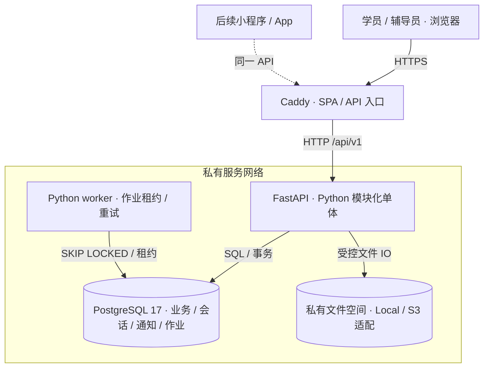
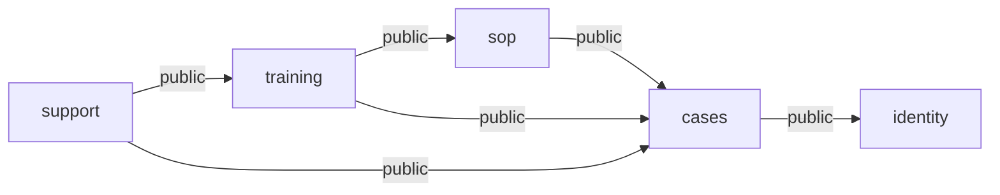
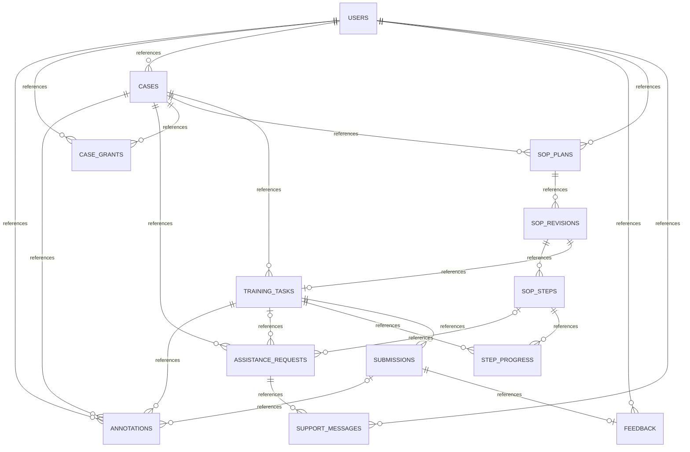
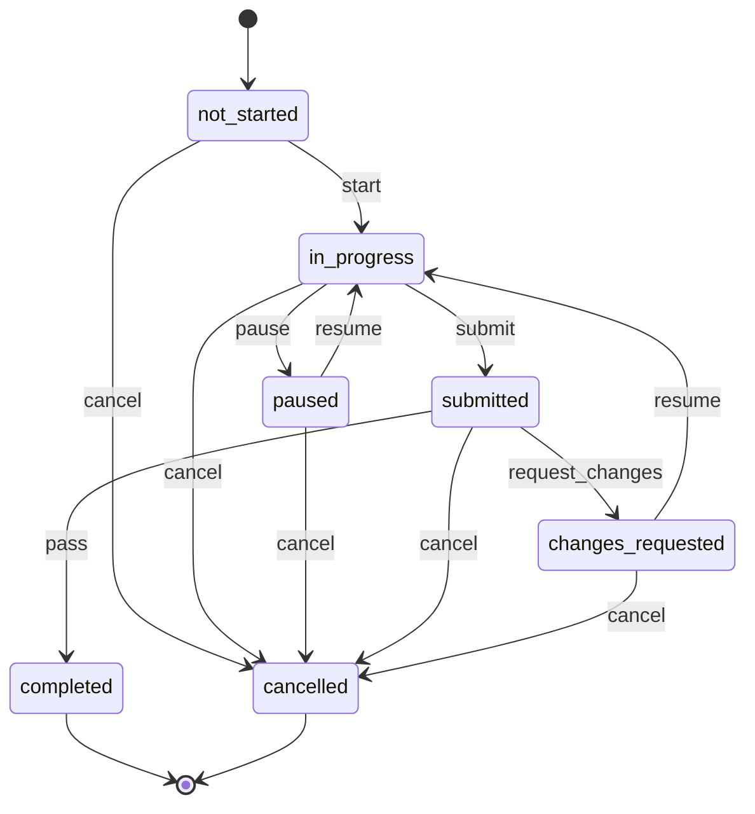
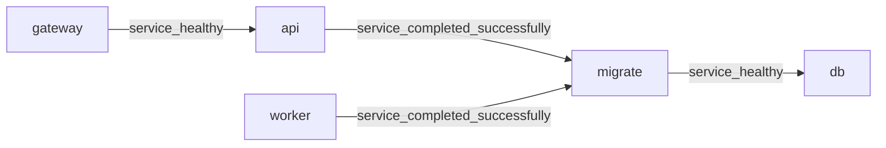

# 工程架构

## 运行边界

容器与存储适配边界；虚线为后续客户端。业务用例由 API 编排，worker 独立领取持久化作业。

## 允许的模块依赖

跨模块只导入 public；core 不依赖基础设施，基础设施不导入业务模块。

## 核心数据关系

图示主要外键关系；组合外键、唯一性、部分索引和不可变触发器见迁移。

## 训练状态

## 部署依赖

## 接口归属

| 模块 | 契约操作 | 已接入 HTTP |
| --- | ---: | ---: |
| cases | 8 | 0 |
| identity | 9 | 1 |
| infrastructure | 7 | 0 |
| platform | 2 | 2 |
| sop | 7 | 0 |
| support | 12 | 0 |
| training | 10 | 0 |

接口契约覆盖业务范围；健康检查接入 HTTP，业务路由在对应模块后续实现时登记。
