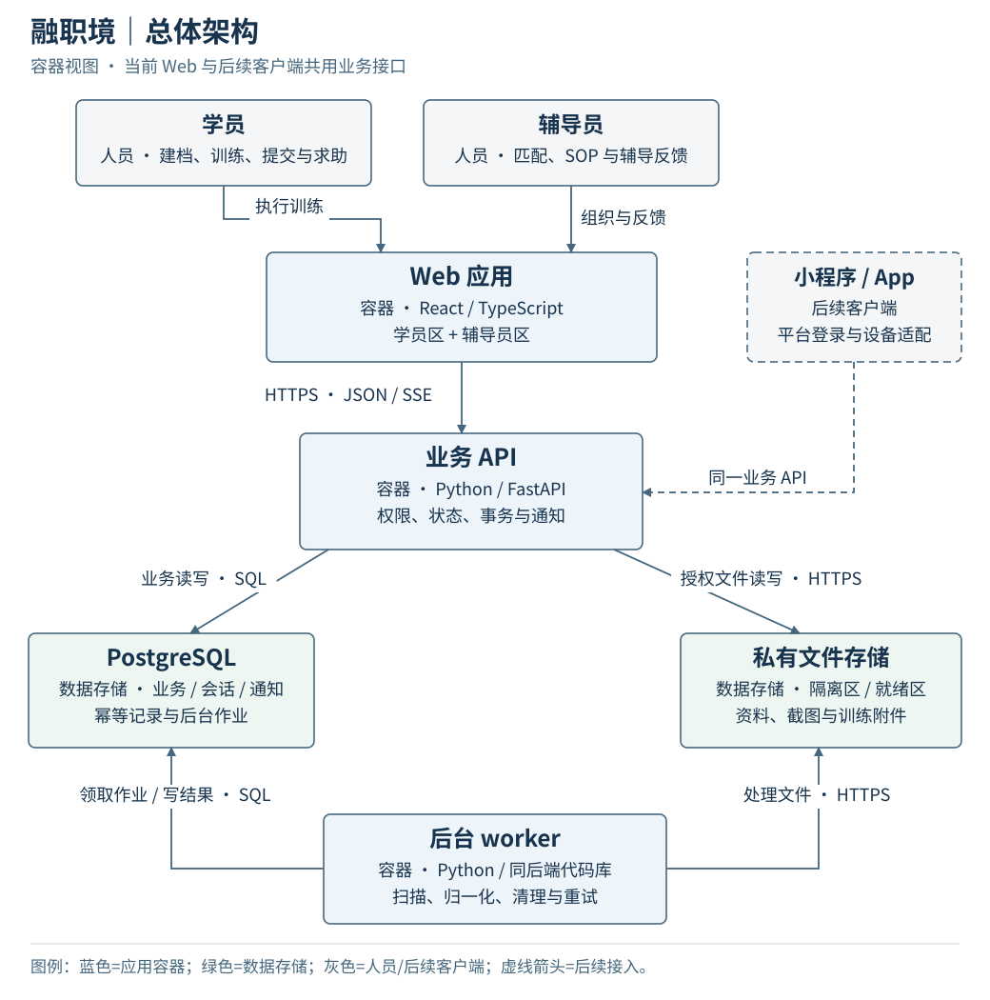

# 融职境系统架构（v0.1 评审稿存档）

这是 #5 评审时的架构设计文档和六张架构图，保留作说明与展示用。它不跟随实现更新：现行接口以 `contracts/openapi.yaml` 为准，工程约定见 `docs/development.md`，开发任务见 #26–#38。

[系统架构](architecture.md)

| 视图 | 内容 |
| --- | --- |
| [总体架构](figures/01-containers.svg) | Web、后续客户端、业务 API、worker 与数据存储 |
| [后端组件](figures/02-components.svg) | 五个业务模块、用例事务与基础设施适配 |
| [数据关系](figures/03-data.svg) | 个案授权、SOP 版本、训练任务、提交与反馈 |
| [任务状态机](figures/04-states.svg) | 执行、暂停、提交、返工、完成与取消 |
| [发布时序](figures/05-sequence.svg) | 原子发布、幂等结果与学员通知 |
| [部署拓扑](figures/06-deployment.svg) | HTTPS 入口、私有运行区与独立备份 |
