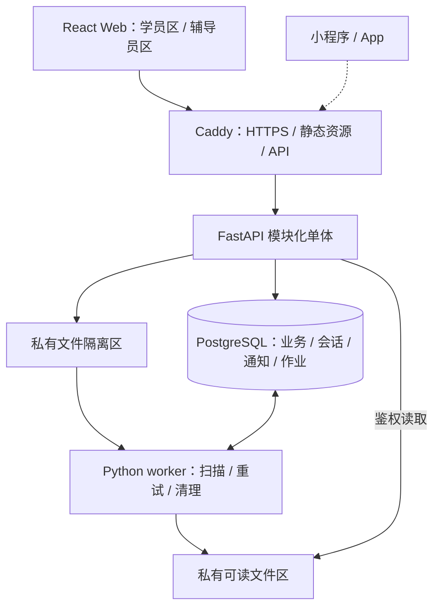
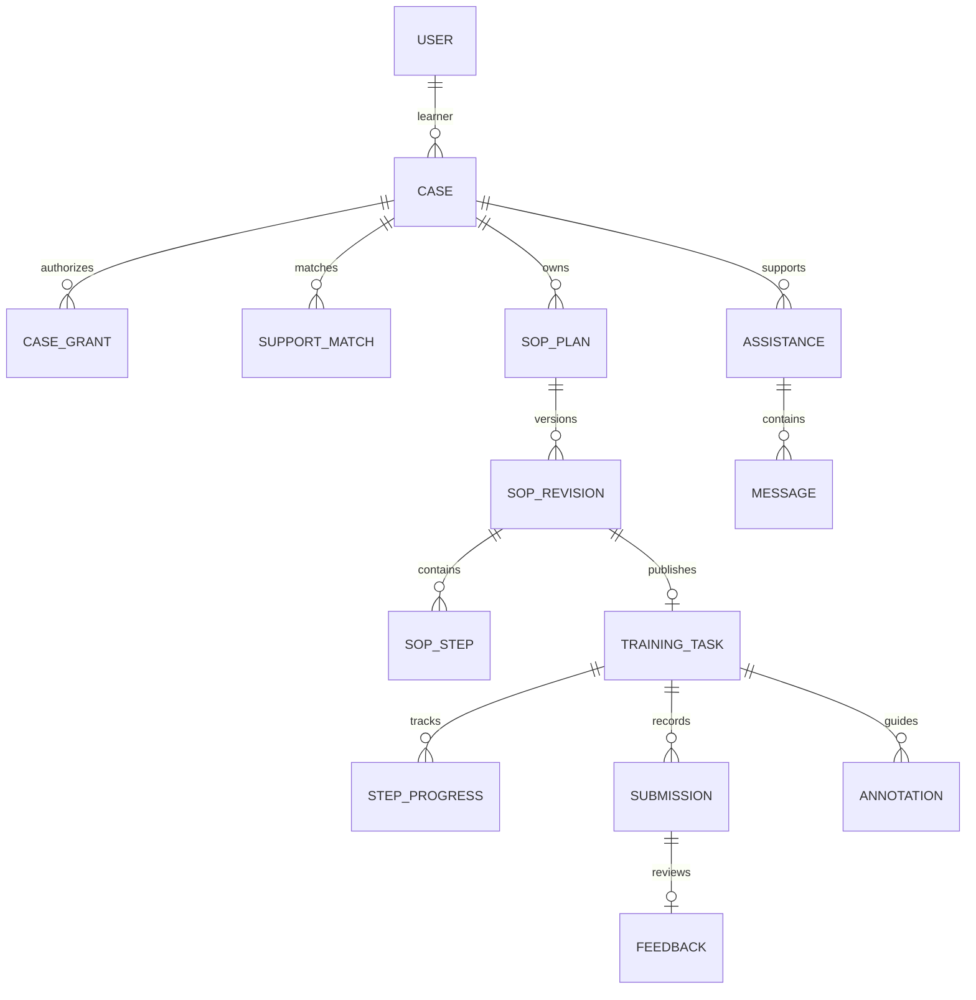
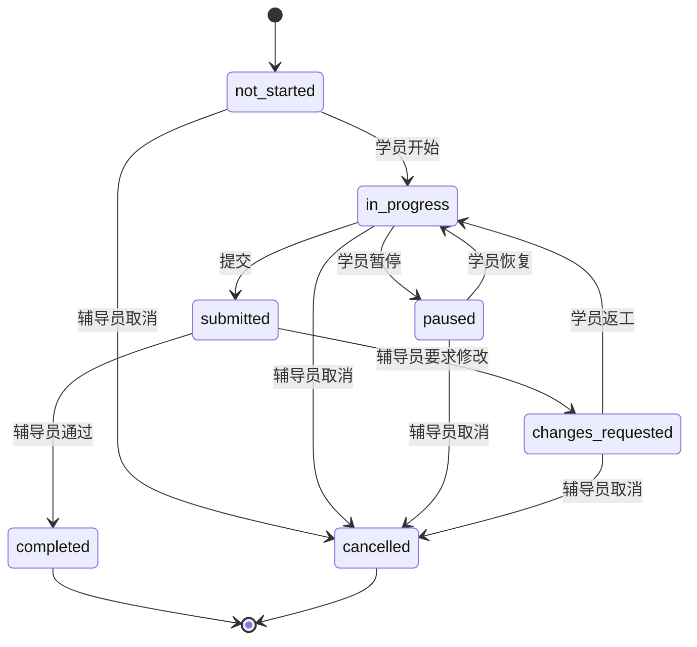
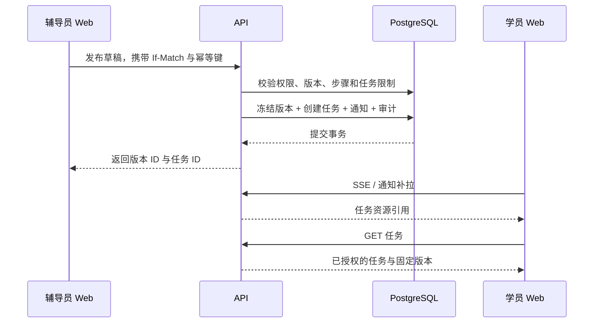

# 融职境系统架构设计文档

## 一、系统范围

融职境连接岗位训练学员与辅导员。核心流程为：**建档与偏好设置 → 支持匹配 → SOP 制定发布 → 分步训练与提交 → 辅导反馈 → 修改或完成**。首个训练场景为文档质检助理。[P1][P2]

采用单仓库、单 Web 工程和 Python 模块化单体后端。Web 分学员区、辅导员区；后续小程序和 App 复用账号、业务 API、权限与数据，客户端界面和设备能力按平台适配。

| 交付层次 | 功能范围 | 完成条件 |
| --- | --- | --- |
| 最小闭环 M2 | 账号、资料与偏好、工作资料上传、支持匹配、SOP 编辑发布、训练、提交、反馈与返工。 | 双端通过真实 API 完成一次完整训练；历史版本、提交与反馈可追溯。 |
| 试用版本 M3 | 图文求助、截图标注、在线通知、任务提示调整、训练记录；文件安全、权限、设备与恢复验证。 | 交叉授权、断线恢复、设备降级及备份恢复测试通过。 |
| 扩展能力 M4 | 通话、自动 SOP 转换、实时 AR/3D、企业报告共享。 | 按第十一章确定范围和依赖，单独排期。通话若为试用必需，前移至 M3。 |

首版不开发企业门户、小程序、原生 App、独立内容管理后台、C++ 服务或微服务集群。SOP 使用结构化人工编辑；拍照核验由辅导员完成。实时 AR、自动转换与定位需求保留为独立决策项。[P2，第 11–21 页；P3，第 3–4、6–7 页]

## 二、总体架构与技术栈

### 2.1 运行结构

浏览器经 HTTPS 访问 Caddy；网关提供 Web 静态资源，并将 `/api/v1` 转发至 FastAPI。API 和 worker 共用 PostgreSQL 与私有文件存储。只有网关暴露公网端口。



worker 与 API 使用同一代码库，分别运行。业务事务在 API 完成；扫描和清理通过数据库作业执行。会话、幂等记录、通知与作业状态持久化，进程重启不丢失。

### 2.2 技术选型

| 层次 | 选型 | 用途 |
| --- | --- | --- |
| Web | TypeScript、React 19、Vite；Node.js 24、pnpm。 | 双角色单页应用；Node 仅用于构建。 |
| 路由与数据 | React Router、TanStack Query、类型化 fetch。 | 路由、服务端数据缓存、请求与错误处理。 |
| 交互与样式 | React Hook Form、语义化 HTML、CSS Modules、CSS 变量。 | 表单、局部样式、统一主题与低刺激设置。 |
| 接口 | OpenAPI 3.1.1、openapi-typescript。 | 契约、类型生成、Mock 与实现一致性检查。 |
| 后端 | Python 3.13、FastAPI、Pydantic 2、Uvicorn。 | HTTP 接口、输入输出校验、用例服务。 |
| 数据 | PostgreSQL 17、SQLAlchemy 2、psycopg、Alembic。 | 关系数据、事务和版本化迁移。 |
| 文件与作业 | 私有存储适配器、PostgreSQL jobs、Python worker。 | 文件隔离、扫描、重试与清理。 |
| 测试与质量 | pytest、HTTPX、Vitest、Testing Library、MSW、Playwright；Ruff、mypy、ESLint、tsc。 | 后端、组件、契约、端到端测试与静态检查。 |
| 部署 | Docker Compose、Caddy、GitHub Actions。 | 环境编排、TLS 入口与持续集成。 |

工程初始化时固定运行时版本、`pnpm-lock.yaml`、`uv.lock` 和镜像摘要；依赖升级通过独立 PR 验证。同步 ORM 调用放在同步请求处理或线程执行边界内，避免阻塞 SSE 事件循环。

### 2.3 关键取舍

| 决策 | 选择依据 | 代价与调整条件 |
| --- | --- | --- |
| 模块化单体，而非微服务 | 当前一名后端主责；统一部署与事务，减少跨服务协调。 | 独立扩缩容受限；出现持续资源瓶颈或独立团队后再拆分。 |
| React SPA + Python API，而非全栈 React | 主要页面为登录后的工作台，业务服务由 Python 承担。 | 路由、缓存和错误处理需明确建设；新增公开内容 SEO/SSR 需求时重评。 |
| FastAPI，而非 Django/DRF | 以定制业务 API 为主，匹配 Python 与 SQL 技能。 | 认证、权限和管理工具需自行组织；不依赖现成后台。 |
| 关系表 + 受约束快照，而非全量 JSON | 身份、关系、状态和唯一性需要外键与约束。 | SOP、提交快照增加存储；JSONB 限于有 Schema 的快照、偏好和几何。 |
| Cookie 服务端会话，而非首版 JWT 体系 | 支持统一撤销，降低 Web 凭据管理复杂度。 | 增加会话查询与 CSRF 防护；其他客户端另设身份适配。 |
| 数据库通知 + SSE，而非消息集群 | 业务变更与通知可同事务提交，便于恢复。 | 连接与补拉负载需测试；外部推送或持续高负载时重评。 |
| Web 优先，而非三端同时开发 | 先完成业务闭环，避免提前承担三端授权、SDK 与发布成本。 | 原生或小程序页面可能重写；业务后端保持共用。 |

## 三、模块与工程结构

### 3.1 后端模块

| 模块 | 数据与职责 | 对外边界 |
| --- | --- | --- |
| `identity` | 用户、角色、会话、档案、偏好、外部身份映射。 | 提供主体与授权信息，不修改训练状态。 |
| `cases` | 个案、分配授权、支持方向、重点、周期与匹配。 | 提供个案访问范围及已确认支持关系。 |
| `sop` | 计划、草稿、发布版本、步骤与提醒配置。 | 发布内容不可变；训练任务固定引用版本。 |
| `training` | 任务、步骤进度、观测事件、提交、反馈与记录。 | 执行状态机，维护提交快照和返工历史。 |
| `support` | 求助、上下文消息、标注及任务提示覆盖。 | 参与者由个案授权确定；支持内容关联任务或提交。 |
| 公共基础设施 | 配置、事务、文件、通知、作业与审计。 | 供模块调用，不承载具体业务状态规则。 |

依赖方向为 **router → service → models / infrastructure**。路由处理 HTTP、身份与序列化；服务层处理授权、业务校验和事务；基础设施封装数据库及外部服务。跨模块写入通过服务接口；聚合查询统一检查资源权限。一次业务用例由最外层服务提交事务，内部函数不独立 `commit`。

### 3.2 目录结构

```text
job-lens/
  apps/
    web/src/
      app/                 路由、Provider、应用壳
      features/            auth、profile、learner、counselor、sop、training、support
      shared/              ui、api、platform
      index.css            reset、基础排版、全局可访问性
      theme.css            色彩、字号、间距、低刺激主题
    api/
      app/modules/         identity、cases、sop、training、support
      app/core/            配置、错误、授权入口
      app/infrastructure/  db、storage、jobs、notifications
      migrations/
      tests/
  contracts/
  tests/e2e/
  infra/
  docs/
```

模块内部先使用 `router.py`、`schemas.py`、`service.py`、`models.py`，随复杂度增加再细分。前端页面样式随功能放置；`shared` 只收纳实际共用能力。前端 A 维护公共工程，B 共同建设组件；不复制登录、请求层、上传和偏好逻辑。

### 3.3 契约工作流

接口变更依次经过：**更新 OpenAPI 与示例 → 后端及两名前端确认 → 生成类型与 Mock → 实现 → 契约回归**。前端服务端数据由 TanStack Query 管理，局部交互状态留在组件或功能模块中。CI 比较 FastAPI 运行时契约与约定契约，检查路径、请求、响应及必填字段漂移。

## 四、数据模型与状态

### 4.1 对象关系



资源 ID 使用 UUID；用户、任务等资源由服务端创建，草稿中的步骤 ID 保持稳定。学员可读编号单独保存。时间统一存 UTC，以 RFC 3339 输出；业务日期为 `YYYY-MM-DD`。可变聚合具有 `version`；不可变快照包含 `schema_version`，按对应模型校验。

### 4.2 核心数据与约束

| 数据对象 | 关键字段 | 不变量 |
| --- | --- | --- |
| `users / user_roles / sessions` | 登录名、密码摘要、角色、令牌摘要、到期与撤销时间。 | 登录名唯一；角色受控授予；撤销会话立即失效。 |
| `profiles / preferences` | 姓名、支持偏好、沟通方式、工作说明；字号、音量、安静模式。 | 档案与 UI 偏好分开；辅导员只读必要支持信息。 |
| `cases / case_grants` | `learner_id`、生命周期、`counselor_id`、授权范围、撤销时间。 | 匹配前先分配读取授权；角色本身不授予个案访问权。 |
| `support_matches` | 方向、重点、周期、依据、状态、版本。 | 每个个案一份当前匹配；已确认内容保留历史。 |
| `sop_plans / sop_revisions` | 个案、计划、版本号、目标、发布时间。 | 计划内版本号唯一；至多一份当前草稿；发布后内容冻结。 |
| `sop_steps` | 版本、步骤 ID、顺序、说明、素材、证据要求、预计时长。 | 同版本步骤 ID 与顺序唯一；素材为已授权的 ready 文件。 |
| `training_tasks` | 个案、发布版本、状态、当前步骤、截止日期、版本。 | 每次发布生成唯一任务；当前采用每个个案最多一项非终态任务，见 Q03。 |
| `step_progress / task_events` | 步骤状态与附件；事件 ID、会话 ID、序号、类型、数值。 | 步骤属于当前版本；事件去重；观测事件不直接改变完成状态。 |
| `submissions` | 任务、尝试序号、版本、快照、提交时间。 | `(task_id, attempt_no)` 唯一；提交内容不可变。 |
| `feedback` | 提交、结论、说明、返工步骤、作者。 | 每次提交一份主反馈；只审核最新待审提交。 |
| `annotations` | 任务、提交、原图、点位、状态、版本。 | 上下文一致；坐标归一化；发布后不可更换原图或修改内容。 |
| `assistance / messages` | 个案、任务、步骤、状态、正文、作者。 | 参与者由授权关系确定；消息追加写。 |
| `files / file_links` | 用途、存储键、校验和、类型、大小、状态、业务引用。 | 文件私有；关联前校验归属；被引用文件不可直接删除。 |
| `notifications / counters` | 接收者、序号、类型、对象引用、已读时间。 | 接收者隔离；序号按提交顺序分配；通知与业务同事务。 |
| `idempotency / jobs / audit` | 请求指纹与结果；租约与重试；主体、操作、结果。 | 幂等结果可重放；作业可恢复；审计脱敏且不可由业务用户修改。 |

查询索引覆盖 `case_grants(counselor_id, revoked_at)`、`training_tasks(case_id, status)`、`submissions(task_id, attempt_no)`、`notifications(recipient_id, seq)`、`jobs(state, next_run_at)`。根据查询计划和负载测试调整组合索引。

### 4.3 生命周期

| 对象 | 状态 | 展示与处理 |
| --- | --- | --- |
| 个案 | `pending_match / active / closed` | “SOP 待制定、训练中、待反馈”等由关联对象派生。 |
| SOP 版本 | `draft / published / archived` | 调整内容生成新版本；进行状态来自训练任务。 |
| 任务 | `not_started / in_progress / paused / submitted / changes_requested / completed / cancelled` | `submitted` 在辅导员端显示“待反馈”；通话、标注为辅导方式。 |
| 求助 | `queued / accepted / resolved / cancelled` | 区分已发送、已接单和已解决。 |
| 文件 | `quarantined / scanning / ready / rejected / deleted` | 上传完成后仍需扫描，ready 才能读取和关联。 |



提交后锁定本次内容。要求修改时仅重置指定步骤，其余进度保留；再次提交增加 `attempt_no`。`completed`、`cancelled` 为终态。客户端提交动作，由服务端校验权限和转移条件；不提供任意设置 `status` 的接口。

## 五、业务事务与统计

### 5.1 SOP 发布

校验辅导员授权、已确认匹配、草稿版本、完整步骤、ready 素材及当前任务限制；同一事务内冻结 SOP、创建任务、写入通知与审计。幂等键与业务唯一约束共同防止重复发布。



学员收到通知后重新读取任务。发布响应超时使用原幂等键重试，返回原任务。

### 5.2 提交与反馈

**提交**：锁定任务，检查版本、状态、必需步骤和附件；从已保存进度生成不可变快照，增加尝试序号，将任务置为 `submitted`，同时写通知。作者、学员与 SOP 版本均由后端关联确定。

**反馈**：锁定任务与当前提交，验证为最新待审提交，写入主反馈。`passed` 完成任务；`changes_requested` 必须指定返工步骤，重置这些步骤并保留原提交及附件。状态冲突返回 409，版本冲突返回 412。

### 5.3 训练数据口径

`hint_requested` 记录主动请求提示；`self_reported_error` 记录学员自报错误。`time_sample.value` 为同一 `session_id + step_id` 的累计毫秒，取最高有效 `sequence` 对应值，再跨会话汇总，不能逐条相加。

事件按 `event_id` 去重；同 ID 不同内容返回冲突。求助次数取服务端成功创建的求助记录，避免和客户端事件重复计数。记录展示统计窗口与缺失项；能力评分和匹配百分比另行定义。

## 六、认证与权限

### 6.1 账号和会话

初次试用采用受控账号发放与个案分配。开户建立用户、档案和偏好；学员同时建立个案及匹配草稿，辅导员通过 `case_grant` 获得匹配前的读取权限。

Web 使用不透明会话令牌，随机强度不少于 256 位，数据库只存摘要。Cookie 为 `__Host-jl_session`，设置 `Secure`、`HttpOnly`、`Path=/`、`SameSite=Lax`，不设置 Domain。会话绝对有效期 12 小时、闲置 2 小时；登录轮换，退出或禁用时撤销。令牌不进入 localStorage、URL 或日志。

浏览器先取得预登录 CSRF，再提交账号密码；登录响应返回用户信息和新的 CSRF 值。所有写请求校验 Origin 与 CSRF。登录按账号和来源组合限流，统一返回账号或密码错误。

### 6.2 资源授权

| 对象 | 学员权限 | 已授权辅导员权限 |
| --- | --- | --- |
| 档案与偏好 | 读写本人。 | 只读必要支持信息，不修改学员偏好。 |
| 个案与匹配 | 读取本人进展。 | 读取被分配个案，编辑及确认匹配。 |
| SOP | 读取本人发布版及历史任务引用版。 | 编辑草稿、发布新版本。 |
| 任务与提交 | 执行并提交本人任务。 | 查看、反馈；取消需说明原因。 |
| 求助与消息 | 发起、参与和取消本人求助。 | 接单、回复、解决授权个案的求助。 |
| 标注与文件 | 读取授权内容，创建问题标注。 | 制作指引标注，读取授权资料。 |

无关辅导员禁止访问。请求依次检查会话、操作权限、资源关系、业务状态和字段白名单；列表先按授权过滤再分页。详情、统计、附件、消息与通知使用同一权限边界。无读取权返回 404；有读取权但无操作权返回 403。

授权撤销后下一次请求失效；SSE 定期重新授权并在会话失效时关闭。前端清理对应缓存。关系结束后的历史访问期限见 Q08。

### 6.3 数据与审计

档案、支持偏好、训练记录、现场照片和企业材料均限制访问。默认不采集身份证、诊断证明、精确地址或 GPS，不录音录像。账号角色变更、分配与撤销、SOP 发布、反馈、文件读取及导出写入审计。

应用日志保留 14 天，通知保留 30 天，未关联临时文件 24 小时后清理。业务资料、审计和备份保留期限由 Q08 确定；删除流程覆盖原文件、展示图、派生数据与备份过期周期。

## 七、文件、标注与通知

### 7.1 文件处理

文件流程：**上传 → 私有隔离 → 持久化扫描作业 → 类型和内容检查 → ready / rejected → 关联业务对象**。扫描服务不可用时保持隔离。

| 规则 | 配置 |
| --- | --- |
| 上传限额 | 图片 10 MiB；PDF/DOCX 20 MiB；单次最多 5 个附件。 |
| 内容校验 | 检查实际类型、恶意内容、像素数、解压大小及处理超时；拒绝 HTML、SVG、可执行文件和宏文档。 |
| 读取 | 通过授权 API 返回文件；隐藏存储键，按真实 MIME 和安全 disposition 返回。 |
| 标注素材 | 对图片应用 EXIF 方向，保存展示图尺寸、校验和与版本；PDF/DOCX 标注使用另行上传的截图。 |
| 删除 | 仅上传者可删除未被业务引用的文件；已引用返回 `FILE_IN_USE`。 |

本地开发使用私有目录，试用部署使用私有对象存储，均通过相同存储接口。PDF/DOCX 首版仅下载；视频播放、Range 下载和文档解析属于扩展能力。附件未 ready 时允许先发文字求助。

### 7.2 二维标注

标注绑定展示图。点位保存 `x/y`；矩形保存 `x/y/width/height`，均为 0–1 相对坐标。服务端校验 `x+width≤1`、`y+height≤1`；前端换算扣除 `object-fit` 留白。

学员创建 `question`，辅导员创建 `guidance`。草稿仅作者可读，发布后授权参与者可读；发布内容不可变。换图生成新的文件和标注，旧点位继续关联旧图。标注发布不改变任务审核结论。

### 7.3 求助与消息

求助保存成功显示“已发送，待响应”；辅导员接受后显示“已接单”。同个案和任务存在未结束求助时，返回已有请求引用，进入原线程。消息仅在该上下文内追加，已结束请求不能追加。

没有支持关系、关系撤销、网络失败分别显示对应处理入口。拒绝相机或缺少照片仍能提交文字。服务时段和人工联系路径见 Q09。

### 7.4 在线通知与恢复

通知与业务变更同事务保存。每个接收者维护独立序号；分配序号时锁定计数行并持有至提交，确保游标顺序与提交顺序一致。多接收者按固定用户 ID 顺序加锁。内存事件仅负责唤醒，补拉以通知表为准。

Web 使用一条主 SSE 连接，15 秒心跳，代理关闭缓冲。断线指数退避；通过 `Last-Event-ID` 或 `after_seq` 恢复。回到前台重新读取任务和求助；SSE 不可用时每 5 秒轮询。页面关闭后的通知需另接平台推送。

序号用十进制字符串传输。`after_seq=0` 从保留窗口起点读取；非零游标过期返回 410。`next_seq` 为本次最后返回序号；无新项时保持原值。客户端按通知 ID 去重，事件只携带类型与资源引用，完整对象再次鉴权读取。

## 八、前端与多端接入

### 8.1 页面组织

| 区域 | 路由 | 主责 |
| --- | --- | --- |
| 公共 | `/login`、`/profile`、`/preferences` | A 牵头，B 共建。 |
| 学员 | `/learner`、`/learner/tasks/:id`、`/learner/records`、`/learner/support/:id` | A。 |
| 辅导员 | `/counselor`、`/counselor/cases/:id`、`/counselor/sop/:id`、`/counselor/submissions/:id` | B。 |
| 标注与辅导 | 关联任务、提交或求助页面。 | B 编辑器，A 阅读与求助入口。 |

每页覆盖加载、空数据、错误、无权限、版本冲突与成功状态。保存失败保留输入；412 时读取最新数据并提示冲突，不覆盖其他端修改。通知按资源引用刷新相应查询。

### 8.2 低刺激与设备适配

训练页突出当前步骤，固定操作词，保持暂停和求助入口可见。安静模式优先关闭声音与震动；文字信息始终保留。减少动态效果设置取消装饰动画。完成反馈页的自动返回需支持阅读与取消。[P3]

可访问性按 WCAG 2.2 AA 测试：对比度、键盘操作、焦点可见、读屏名称、200% 字号缩放和触控目标；状态不只依靠颜色区分。[R3]

| 能力 | Web 适配 | 失败处理 |
| --- | --- | --- |
| 相机与选图 | `captureImage / pickFile`；HTTPS 下由用户动作触发。 | 权限拒绝或设备不可用时，提供选图与文字求助。 |
| 语音 | `speak`；用户主动启用，遵循音量与安静设置。 | 保留完整文字。 |
| 震动 | `vibrate`；能力检测后调用。 | 使用视觉提示，不阻断任务。 |
| 标注 | 共享几何模型，客户端负责编辑和渲染。 | 图片不可用时显示标注文字列表。 |
| 通话 | `joinCall`，接入选定 RTC 服务。 | 权限失败、挂起和断线回到上下文消息。 |

适配结果区分 `unsupported / permission_denied / cancelled / failed`。先实现 Web 适配；新增客户端时实现同一能力边界。

### 8.3 多端演进

**Web 容器路线**：评估 Capacitor 复用 Web 页面，补充登录、相机、文件和 SDK 桥接。**独立客户端路线**：实现小程序或原生界面，继续调用现有业务 API；复用生成类型、数据模型和纯逻辑，平台组件分别维护。

平台身份兑换后映射到同一 `user_id`，不以 openid 等外部标识作为业务主键。小程序 WebView 或 App 容器接入前验证登录态、域名、设备权限、后台行为与发布条件。

## 九、部署与验收

### 9.1 环境和发布

开发、测试、试用环境分别配置数据库、文件空间、密钥和账号。开发使用合成数据；试用关闭 seed、调试登录和演示账号。API 单实例起步，按压测结果扩容。

worker 使用租约和 `FOR UPDATE SKIP LOCKED` 领取作业。处理须幂等；失败按 `next_run_at` 重试，超出上限进入人工处理队列。

数据库迁移作为独立发布步骤执行，采用“扩展 → 数据迁移 → 收缩”。破坏性迁移先备份并确认回退方案；应用回滚不得依赖任意逆向数据库迁移。

CI 执行前后端静态检查、单元/组件测试、契约检查及关键 E2E。所有新增迁移验证空库升级与已有数据升级。

### 9.2 监控与恢复

日志包含 `trace_id`、操作、对象 ID、状态码、延迟和脱敏错误。监控 API 错误率及 p95、数据库连接、通知滞后、扫描积压、worker 心跳与存储容量。`/health/live` 检查存活，`/health/ready` 检查数据库等关键依赖。

每日加密备份至不同故障域。恢复目标为 **RPO≤24 小时、RTO≤4 小时**；演练同时核对数据库记录与文件引用。

### 9.3 验收矩阵

| 项目 | 测试与门槛 |
| --- | --- |
| 业务闭环 | 发布、执行、提交、返工、再次提交、通过全链路 E2E；非法状态转移有负例。 |
| 资源权限 | 双学员、双辅导员交叉测试列表、详情、统计、文件、通知和消息，全部拒绝越权。 |
| 幂等与并发 | 同键发布仅一任务、提交仅一快照；同版本并发修改最多一个成功；成功请求可重放。 |
| 文件 | 越权下载、伪造类型、扫描失败、引用删除与孤立清理测试通过。 |
| API 性能 | 100 活跃会话、10 req/s、10 万合成事件；普通 JSON API p95≤800 ms、错误率<1%；文件传输和 RTC 单独测试。 |
| 通知 | 健康网络下写入至前台显示 p95≤3 秒；断线、过期游标和会话撤销可恢复。 |
| 兼容与可访问性 | 固定桌面浏览器、Android Chrome、iOS Safari 的测试版本；验证权限拒绝、前后台切换、键盘、读屏、缩放及对比度。 |
| 恢复 | 重启 API/worker 后任务与求助保留；备份恢复满足 RPO/RTO，文件与业务引用一致。 |

## 十、人员分工与开发路径

### 10.1 四人分工

| 成员 | 架构阶段 | 开发阶段 |
| --- | --- | --- |
| **刘峥岩：总体架构、统筹** | 技术路线、模块边界、范围决策、设计评审。 | 进度与产品协调、跨模块问题处理、关键变更和阶段验收。 |
| **贺凡恩：后端** | 数据模型、权限、状态机、接口及部署设计。 | Python 业务服务、迁移、文件/通知/作业、后端测试和部署。 |
| **前端 A：学员端、公共前端** | 学员流程、公共工程、偏好和设备适配。 | 学员页面、登录、请求层、公共组件、Web 构建和学员端测试。 |
| **前端 B：辅导员端** | 工作台、个案、SOP、反馈和标注交互。 | 辅导员页面、SOP 编辑器、标注编辑器、公共 UI 共建和辅导员端测试。 |

各模块负责人提交详细设计并负责自测；A/B 共同维护双端 E2E。普通 PR 交叉评审；影响身份权限、状态机、模块边界和跨端策略的变更由刘峥岩审核。

### 10.2 阶段任务

| 阶段 | 负责人和依赖 | 交付与完成标准 |
| --- | --- | --- |
| M0 架构 | 刘峥岩组织；贺凡恩、A、B 分别复核。 | 确定 Q01–Q04；模块、数据、状态、接口和设备验证方案一致。 |
| M1 工程骨架 | 贺凡恩 + A，B 验证；依赖 M0。 | 目录、依赖锁、配置、迁移入口、健康检查、类型生成、Mock、CI；干净环境可启动。 |
| M2-A 账号/资料/匹配 | 贺凡恩 + A/B；依赖 M1。 | 登录、偏好、资料上传、授权查看、匹配草稿与确认完成双端联调。 |
| M2-B SOP/训练/反馈 | 贺凡恩 + A/B；依赖 M2-A。 | 草稿编辑、发布、分步训练、提交、反馈和返工闭环；幂等及权限负例通过。 |
| M3 辅导与试用 | 贺凡恩 + A/B；依赖 M2。 | 求助、标注、提示调整、记录、文件安全与通知恢复；完成真机、压力和备份恢复测试。 |
| M4 扩展 | 按能力指定负责人；依赖对应范围和技术验证。 | 通话、转换、AR 或企业报告按独立接口与验收标准交付。 |

初步工作量：M0 评审刘峥岩 2–3 人日、其余各 1–2 人日；关键能力验证合计 3–5 人日；M1 合计 4–6 人日；M2-A 后端 4–6、前端合计 4–6 人日；M2-B 后端 6–9、前端合计 8–12 人日；M3 后端 5–8、前端合计 7–10 人日。日历排期按成员实际投入与后端依赖确定。

前端可基于契约与 MSW 并行，每阶段联调真实 API。架构结论记录在 Issue #5；PR #6 用于设计评审，后续另开工程骨架 PR，评审合并后进入功能开发。Task 明确负责人、里程碑、依赖和验收条件。

## 十一、待决策项

| 编号 | 需要确定的事项 | 当前方案 | 负责人 / 截止节点 |
| --- | --- | --- | --- |
| Q01 | 首版是否包含企业身份与入口。 | 仅学员、辅导员两个端。 | 刘峥岩与产品 / M0。 |
| Q02 | 账号发放、辅导员资格与个案分配。 | 受控发放，分配后读取个案。 | 产品与贺凡恩 / M0。 |
| Q03 | 多辅导员、多方向、并行任务与重复训练。 | 单当前匹配，每个个案最多一项非终态任务。 | 产品与刘峥岩 / 数据模型确定前。 |
| Q04 | 通话是否试用必需；音频或视频、SDK、预算、录制。 | 先做双设备媒体验证，再确定阶段。 | 产品定范围，三位开发验证 / M0。 |
| Q05 | 自动转换、推荐分数、能力报告的输入、输出和验收。 | 人工结构化 SOP 与描述性记录。 | 产品与辅导方 / 扩展开发前。 |
| Q06 | 定位指图片点位、场所文字还是 GPS。 | 截图点位与可选照片，不采集 GPS。 | 产品 / 求助页定稿前。 |
| Q07 | 企业报告字段、接收者、授权、期限与撤回。 | 保留内部支持记录，共享单独接入。 | 产品与刘峥岩 / 共享开放前。 |
| Q08 | 试用人群、未成年人授权、留存、删除及关系结束后的权限。 | 限制访问；确定资料与备份保留策略。 | 产品组织确认 / 真实资料试用前。 |
| Q09 | 设备、网络、峰值、存储区域、预算、服务时段与人工联系路径。 | 按第九章配置试用环境和验收负载。 | 刘峥岩汇总 / M1 部署设计前。 |

## 技术与需求索引

[P1] 《项目简介》：双端、资料卡、SOP、辅导与记录册。

[P2] 《融职境-辅导员端页面 PRD》：第 1–3 页业务流程，第 9–15 页匹配/SOP/反馈，第 17–22 页通话/标注/状态。

[P3] 《学员端页面 PRD》：第 1–4 页登录、偏好、任务与求助，第 6–7 页资料、转换与记录。

[R1] [OpenAPI 3.1.1](https://spec.openapis.org/oas/v3.1.1.html)；[RFC 9457](https://www.rfc-editor.org/rfc/rfc9457)；[RFC 9110](https://www.rfc-editor.org/rfc/rfc9110)：接口描述、错误和 HTTP 语义。

[R2] OWASP：[Authorization](https://cheatsheetseries.owasp.org/cheatsheets/Authorization_Cheat_Sheet.html)、[Session Management](https://cheatsheetseries.owasp.org/cheatsheets/Session_Management_Cheat_Sheet.html)、[File Upload](https://cheatsheetseries.owasp.org/cheatsheets/File_Upload_Cheat_Sheet.html)。

[R3] [WCAG 2.2](https://www.w3.org/TR/WCAG22/)：前端可访问性验收。
