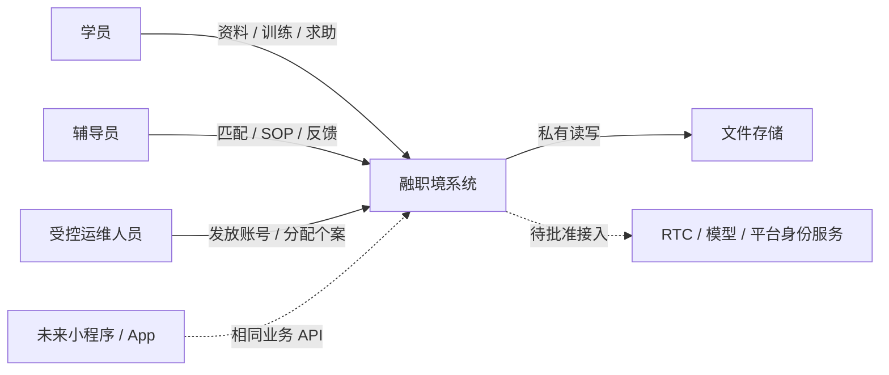
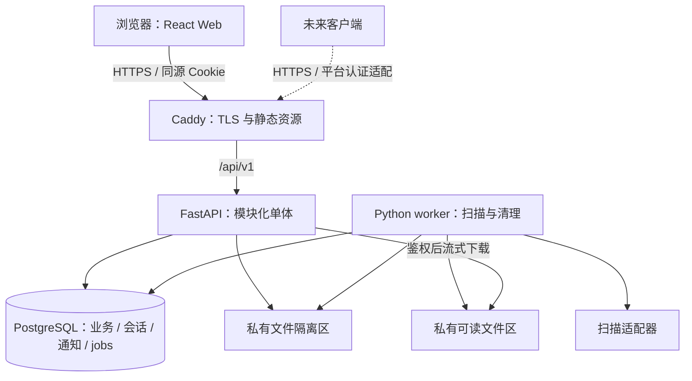
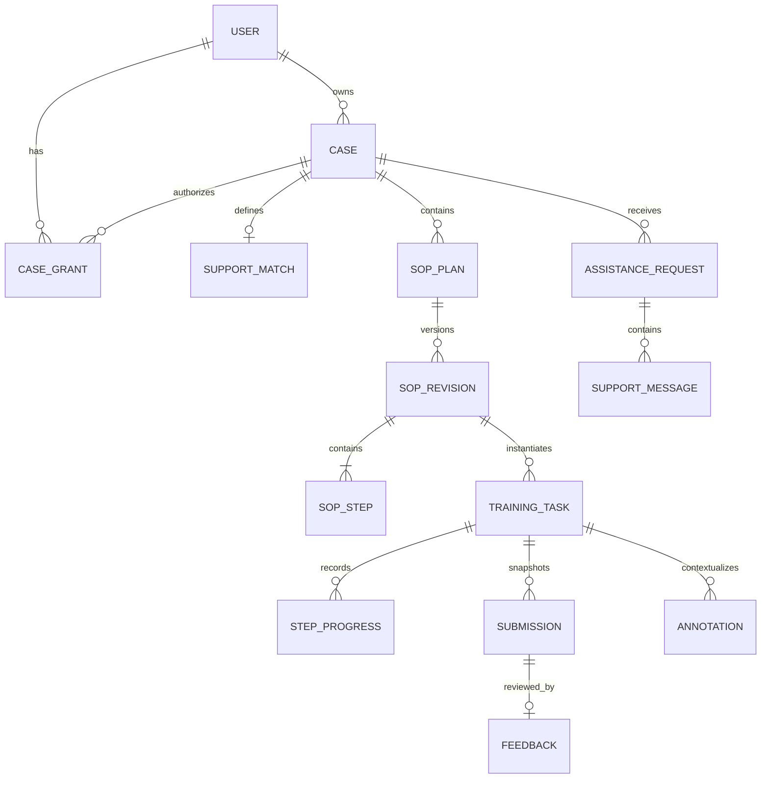
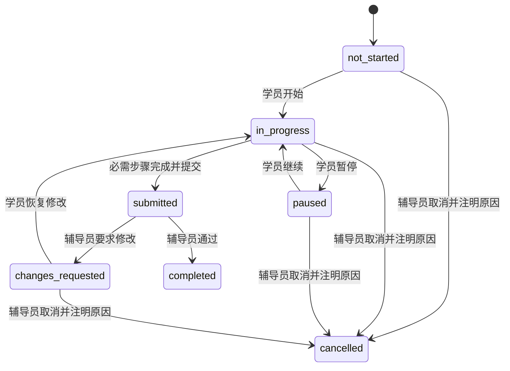
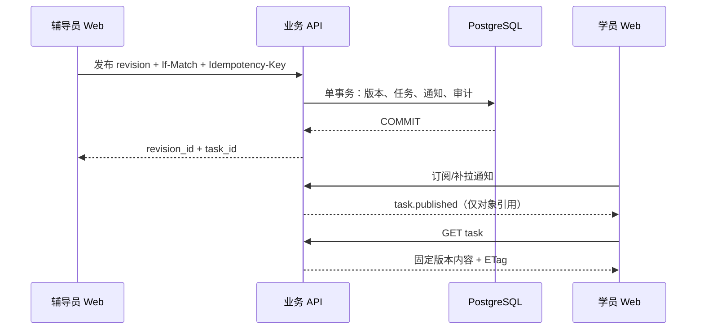

# 融职境系统架构设计文档

> 文档编号：JL-SAD-001；版本：v0.1；状态：**Proposed / 待人工评审**；日期：2026-09-19（UTC+8）。
> 总体架构负责人：刘峥岩；后端负责人：贺凡恩；前端 A、B 姓名待补。
> 关联：[Proposal #5](https://github.com/job-lens/job-lens/issues/5)。仓库基线：`main@f1072e895d74a963740d46f82ab3e97034376306`。
> 本文描述拟建设的系统，不是已实现能力清单。配套接口见 [api-contract.md](api-contract.md)，机器契约见 [openapi.yaml](openapi.yaml)。

## 项目摘要

本提案以“学员建档与偏好设置 → 辅导员支持匹配 → SOP 制定发布 → 学员分步训练与提交 → 辅导员反馈、标注与求助处理 → 修改或完成”为第一条业务主线。业务来源为两端 PRD 和项目简介，不引入排版样例中的模型、知识库或科研功能。[P1][P2][P3]

建议采用一个 React/TypeScript Web 工程、一套 Python/FastAPI 模块化单体、一套 PostgreSQL 数据库和私有文件存储。当前只交付 Web，未来客户端通过相同账号、资源、权限和业务 API 接入。跨端承诺是业务与数据可复用，不是所有 Web 页面自动变为小程序或原生界面。

当前交付是架构与接口提案。依仓库贡献规范，设计 PR 仅供评审、不合并；定稿结论回到 Issue，再提交独立空骨架 PR。只有空骨架经人工评审合并，且对应产品范围明确后，才进入功能实现。[G2]

## 一、文档边界、依据与目标

### 1.1 证据分层

| 标识 | 含义 | 使用规则 |
| --- | --- | --- |
| 原文要求 | PRD、项目简介或仓库明确描述的行为 | 在需求追踪表中保留出处，不因实现困难而悄悄删去。 |
| 工程建议 | 本提案给出的实现和分期方案 | 需要架构评审；不能表述为已经由产品确认。 |
| 待决策 | 来源冲突、缺少定义或外部条件不足 | 指定责任人与决策期限，未决事项不能成为上线承诺。 |
| 长期方向 | README 的 App、企业端、AI 与 AR 等规划 | 保留演进边界，不全部纳入当前 Web 首版。[G1] |

本文采用 arc42 的目标、约束、视图、横切机制、质量与风险组织思路，并以 C4 上下文/容器视图表达系统边界；这是按团队规模裁剪的参考方法，不是宣称通过某项标准认证。[R1][R2]

### 1.2 当前事实与约束

截至基线提交，仓库只有 README、CONTRIBUTING、LICENSE、忽略规则和 Issue/PR 模板，没有前后端业务代码、依赖锁文件、数据库迁移或业务测试。README 将当前阶段标为 MS1；既有 Milestone #1 名为“MS1 · 战略决策与首个可串联版本”。本提案不重命名现有里程碑，也不把计划中的测试写成实测结果。[G1][G2][G3]

团队共四人。刘峥岩负责总体架构与统筹，不承担固定页面包、逐条接口编码或日常运维。贺凡恩的已知技能为 Python、C++、SQL；两名前端按 TypeScript、React 组织。所有实现估算按三名主要开发人员计算；人员熟练度与投入时间仍需各自确认。

### 1.3 成功定义

首先证明两端通过真实后端和持久化数据完成一个训练闭环：同一学员、同一支持关系、同一 SOP 发布版本、同一次提交和反馈能够逐项追溯。其次保证新增客户端无需另建学员、SOP、任务和反馈数据库。最后保证未获授权的辅导员、学员和文件请求都无法越过资源边界。

“页面能点击”“演示数据看起来完整”和“文档写出了接口”均不等于业务完成。本次交付只验证设计资料与契约的内部一致性；运行指标、兼容性、安全与用户测试均留给后续实现阶段。

## 二、需求追踪与首版范围

### 2.1 分期口径

本提案中的 M0–M4 是工作包顺序，不是新建 GitHub Milestone：M0 架构设计；M1 空骨架；M2 最小业务闭环；M3 辅导支持与试用加固；M4 经批准的增强能力。其与仓库 MS1、后续里程碑的映射由组长在评审后决定。M2 是内部集成演示，不自动等于面向真实学员开放。

### 2.2 需求—模块—验收映射

| 编号 | 来源与原文要求 | 本提案处理 | 对应验收 |
| --- | --- | --- | --- |
| FR-01 | 学员 PRD 第 1 页：身份选择、登录、偏好加载 | M2：受控发放账号；服务端角色授权。开放注册方式待 Q02。 | 伪造角色无法提权；重登录恢复个人偏好。 |
| FR-02 | 项目简介第 1 页；学员 PRD 第 6 页：资料卡、工作资料与场景上传 | M2：资料档案与私有文件；文件安全未验收前仅用合成材料。 | 双端看到同一授权资料；其他个案不可访问。 |
| FR-03 | 辅导员 PRD 第 9–11 页：支持方向、重点、周期、草稿与确认 | M2：人工确认匹配，保留匹配依据。 | 确认后学员可见关系，辅导员出现 SOP 待制定事项。 |
| FR-04 | 辅导员 PRD 第 11–13 页：目标、步骤、提醒、发布 | M2：结构化手工编辑；发布版本不可变。 | 一次发布只产生一份对应任务；在训任务不被后续编辑改写。 |
| FR-05 | 学员 PRD 第 4 页：步骤导航、暂停、拍照、提交 | M2：分步执行与人工核验，不声称自动视觉识别。 | 断线不显示虚假提交成功；重新登录可恢复服务端进度。 |
| FR-06 | 辅导员 PRD 第 13–15 页：提交查看、短句反馈、快捷标签 | M2：提交快照与反馈，支持指定步骤返工。 | 修改形成下一次提交；旧提交与旧反馈仍可查。 |
| FR-07 | 辅导员 PRD 第 19–21 页：画面点位、框选与短句标注 | M3：照片/截图二维标注；不等同实时 AR。 | 不同屏幕、缩放与旋转归一化后，点位仍对应同一位置。 |
| FR-08 | 学员 PRD 第 2–4、6–7 页：求助、留言、通知 | M3：可持久化求助与上下文消息；在线 SSE、轮询降级。 | 断线重连补拉；“已发送”与“已接单”分开显示。 |
| FR-09 | 学员 PRD 第 4 页：用时、错误、提示依赖、求助回传 | M2 留事件契约，M3 完成描述性统计；不生成未经定义的能力分数。 | 重复事件不重复计数；展示统计口径和缺失数据。 |
| FR-10 | 学员 PRD 第 1、4、6 页：低刺激、字号、音量、提示、远程提示等级 | M2 基础偏好；M3 任务级提示覆盖与设备降级。 | 安静模式优先，辅导员不能强制打开声音或震动。 |
| FR-11 | 辅导员 PRD 第 17–19 页：发起/接听通话与辅导纪要 | Q04：先做双设备技术验证；批准后进入 M4 或调整首版范围。 | 必须验证真实双向媒体、拒接、超时、断线；假按钮不算完成。 |
| FR-12 | 学员 PRD 第 4、6–7 页：SOP 转换、图解、3D、AR | Q05：保留来源；首版人工编辑是替代建议，不是原文定义。 | 转换输入、输出、人工确认和效果标准批准后再开发。 |
| FR-13 | 学员 PRD 第 3 页：定位与现场照片 | Q06：照片可选；精确位置默认不采集，不纳入核心契约。 | 拒绝设备授权仍能提交文字求助。 |
| FR-14 | 项目简介第 1 页：支持记录册与定期企业汇报 | M3 支持记录；企业共享、导出字段和授权范围归 Q07。 | 首版记录不自动向企业公开；后续共享可审计。 |
| FR-15 | 学员 PRD 第 1 页有企业身份；简介只说两个端；README 范围更广 | Q01：建议本轮仅学员/辅导员两个业务角色。 | 企业入口未启用时不展示可用假页面。 |

### 2.3 M2 最小闭环及 M3 开放门槛

M2 选择一个合成“文档质检助理”案例，以一名学员和已分配辅导员完成建档、匹配、SOP 发布、执行、提交、返工与完成。该案例来自辅导员 PRD 的主场景，不将原型中的姓名、文件和百分比当作真实数据。[P2，第 1、8、14 页]

建议 M3 完成图文求助、截图标注、记录摘要、权限回归、文件安全、真实设备检查和恢复演练后，再进行限定对象试用。若产品要求通话属于首版不可替代能力，则 Q04 必须在 M0 定案并把真实 RTC 接入加入试用门槛，而不是交付后再解释“不包含”。

## 三、架构决策与技术栈

### 3.1 决策记录摘要

| ADR | 建议决策与理由 | 代价与重新评估条件 |
| --- | --- | --- |
| ADR-01 | 模块化单体，而非微服务。单后端负责人可统一事务与部署。 | 模块独立扩缩容受限；只有出现独立团队或持续资源瓶颈才拆服务。 |
| ADR-02 | React SPA + Python API。当前以登录后的双端工作台为主。 | 路由、缓存和错误处理需显式建设；出现公开 SEO/SSR 需求再评估全栈框架。[R3] |
| ADR-03 | Web-first，而非立即三端同建。先验证业务，再验证容器/原生界面。 | 小程序 UI 可能重写；业务 API、权限与结构化内容保持复用。 |
| ADR-04 | PostgreSQL 关系模型；JSONB 仅用于版本化快照、标注几何与受约束偏好。 | 需迁移管理；不以一个任意 JSON 字段代替所有业务关系。 |
| ADR-05 | OpenAPI 契约先行；FastAPI 实现遵从契约，前端类型由契约生成。 | CI 必须检测运行时契约漂移，避免手写 YAML 与代码长期双轨。[R4][R5][R14] |
| ADR-06 | Web 使用服务端不透明会话和 HttpOnly Cookie，未来原生端单独适配凭据传输。 | 后端需查询会话并处理 CSRF；本轮不实现自建 OAuth 服务或 JWT 刷新体系。 |
| ADR-07 | SOP 发布版本、提交与反馈不可变；任务具有独立生命周期。 | 多保存少量快照，以换取历史可追溯；不能直接覆盖旧训练记录。 |
| ADR-08 | 数据库持久化通知 + SSE/轮询，不引入 Redis、Kafka。 | 大规模连接需重新测量；外部推送/RTC 引入后再评估可靠消息出口。 |
| ADR-09 | 私有文件访问；异步扫描任务持久化，不以请求内后台回调承载关键任务。 | 增加隔离区与扫描流程；扫描服务不可用时文件不得进入可读状态。 |
| ADR-10 | AI、AR、RTC 为明确边界的后续能力，不侵入核心任务状态机。 | 需要专项验证；不可把人工流程标注成已经完成的智能能力。 |

### 3.2 建议技术基线

| 层次 | 选型 | 本项目用途与约束 |
| --- | --- | --- |
| Web 运行与构建 | Node.js 24 LTS、pnpm、TypeScript、React 19、Vite | Node 仅用于构建和开发，不再添加一个 Node 业务后端。[R13] |
| 路由与服务端状态 | React Router、TanStack Query | 路由按角色分区；服务端状态不再复制到另一个全局状态仓库。[R3] |
| 组件与样式 | 语义化 HTML、CSS Modules、CSS 变量；React Hook Form | 样式令牌统一；页面样式就近。首版不同时引入多套大型 UI 框架。 |
| 客户端契约 | openapi-typescript + 类型化 fetch 封装 | 生成 DTO；请求封装集中处理凭据、CSRF、ETag、幂等与错误。[R14] |
| 后端 | Python 3.13、FastAPI、Pydantic 2、Uvicorn | 路由薄层、输入/输出模型校验；业务规则位于服务层。[R4] |
| 数据访问 | SQLAlchemy 2、psycopg、Alembic | 每个用例一个明确事务；同步 ORM 在同步端点中运行，SSE 走异步流；禁止阻塞事件循环。[R11][R12] |
| 数据库 | PostgreSQL 17，锁定实施时受支持补丁 | 关系约束、事务、索引与持久化任务。17 系列为主动选择，并非宣称它是最新大版本。[R10] |
| 文件 | 私有存储接口；开发用本地私有目录，试用用私有对象存储 | 存储键不等于公开 URL；供应商、区域与费用由部署评审确认。 |
| 异步作业 | 同一 Python 代码库的 worker + PostgreSQL jobs 表 | 文件扫描、清理与重试；不是独立业务微服务。不增加 Celery/Redis 依赖。 |
| 测试 | pytest、HTTPX；Vitest、Testing Library、MSW；Playwright | 后端、组件、契约 mock 和双端端到端各有责任人。 |
| 质量与部署 | Ruff、mypy；ESLint、tsc；Docker Compose、Caddy、GitHub Actions | 单一 TLS 入口，统一域名；密钥不入库，部署需人工批准。 |

版本策略：本表固定方向及关键运行时系列；空骨架 PR 再验证完整依赖组合，提交 `pnpm-lock.yaml`、`uv.lock`、运行时版本文件和镜像摘要。安装与 CI 不使用浮动 `latest`。依赖升级独立 PR、附回归结果；发现安全修复按风险优先处理。本次未进行应用依赖安装或兼容性实测。

### 3.3 为什么不以 C++ 做首版业务服务

本次需求重点是账号、流程、记录、文件与双端接口，尚无已量化的原生计算瓶颈。贺凡恩能够使用 C++ 不等于必须引入第二套服务、构建链与部署方式。后续确有需要时，将图像处理等计算能力封装为独立适配器或任务执行器，业务 API 与任务身份保持不变。这是本项目的工程取舍，不是否定 C++ 的适用性。

## 四、系统上下文与部署容器

### 4.1 上下文视图



运维人员不是新增面向用户的管理端。首版建议通过后端受控命令完成账号发放、辅导员资格核验后的授权和个案分配；其操作必须经过同一授权服务并留审计记录。开放注册、自助认领个案、跨机构分配另行评审。

### 4.2 容器与信任边界



仅 TLS 网关对外暴露。数据库、worker、扫描器与文件存储管理端口不得直接暴露公网。原始上传文件不能放在 Web 静态目录，也不能使用不可猜测文件名代替授权。每次文件读取仍检查会话与所属个案。[R7][R9]

SSE 和 REST 使用同一业务入口；SSE 只传最小通知事件，不传文件内容或完整学员档案。API 服务是可信业务边界，客户端提交的角色、学员 ID、个案 ID 和对象 ID 均须重新校验。

## 五、模块划分与代码组织

### 5.1 模块职责

| 模块 | 拥有的能力/数据 | 不应承担 |
| --- | --- | --- |
| identity | 用户、角色、会话、个人档案、偏好、授权凭据映射 | 不由前端传入 role 决定授权；不写任务状态。 |
| cases | 个案、待匹配的访问授权、支持方向/周期、匹配确认 | 不提供全量学员通讯录；不生成未经定义的匹配分数。 |
| sop | 计划、草稿版本、步骤、提示配置、发布规则 | 不直接改学员进行中的任务内容。 |
| training | 任务、步骤进度、事件、提交快照、反馈、描述性记录摘要 | 不把通话连接状态当训练完成；不替代医学或能力诊断。 |
| support | 求助、上下文消息、二维标注、任务级提示覆盖、未来通话纪要 | 不扩张为通用社交聊天或企业协作系统。 |
| shared / infrastructure | 权限策略接口、事务、文件、通知、作业、审计、配置 | 不汇聚所有业务规则成为巨型 common 模块。 |

### 5.2 建议目录（空骨架 PR 才创建）

```text
job-lens/
  apps/
    web/src/
      app/                 # 路由、Provider、应用壳
      features/
        auth/ profile/ learner/ counselor/ sop/ training/ support/
      shared/
        ui/ api/ platform/ # 基础组件、请求层、设备适配
      index.css            # reset、基础排版与全局可访问性
      theme.css            # 色彩、字号、间距、低刺激令牌
    api/
      app/
        main.py
        modules/
          identity/ cases/ sop/ training/ support/
        core/              # 配置、错误、授权入口
        infrastructure/    # db、storage、jobs、notifications
      migrations/
      tests/
      pyproject.toml
  contracts/               # 接受提案后放入批准的 OpenAPI
  tests/e2e/
  infra/                   # Compose、入口配置、备份说明
  docs/
```

前端 A 牵头 app/shared，B 共建；学员区和辅导员区不各复制一套登录与文件组件。模块内部先采用 `router.py / schemas.py / service.py / models.py` 等少量文件，出现实际复杂度再细分；不强制每张表都套接口、仓储与工厂。

后端依赖方向为路由 → 用例服务 → 数据访问/外部适配。跨模块写入通过公开服务接口；跨模块查询允许由明确的只读查询服务聚合，但不得绕过权限策略。SOP 发布用例协调 SOP、training、notification，以同一数据库事务提交；模块内部函数不得各自随意 commit。

共享类型由契约生成。Web DOM、`window`、相机 SDK 仅出现在 Web/platform 层，不进入后端或平台无关数据模型。现在不建立空的小程序/App 工程和无人使用的共享包；第二个真实客户端出现后再提取已经验证可共享的纯逻辑。

## 六、领域模型、约束与状态机

### 6.1 数据关系



外部 ID 使用服务端生成 UUID；列表展示编号与数据库 ID 分开。时间戳为带时区 UTC，接口使用 RFC 3339；周期使用起止日期或周数，不把某个客户端本地时间作为唯一真相。修改型聚合使用整数 `version`，接口通过 ETag/If-Match 协调。

### 6.2 核心表与关键字段

| 表/聚合 | 主要字段 | 强制约束 |
| --- | --- | --- |
| users / user_roles | id、login_name、password_hash、status、roles | 登录名规范化唯一；角色由受控流程授予。 |
| sessions | token_hash、user_id、csrf_hash、expires_at、last_seen_at、revoked_at | 原始会话令牌不落日志；撤销后下一请求失效。 |
| profiles / preferences | user_id、显示名、支持偏好、沟通说明、字号、quiet_mode、volume | 个人资料与 UI 偏好区分；不默认采集诊断证明、证件和精确地址。 |
| cases / case_grants | learner_id、lifecycle、counselor_id、scope、revoked_at | 待匹配也要有分配授权；不因“辅导员”角色而全库可见。 |
| support_matches | case_id、direction、focus、cycle_weeks、basis、state、version | 每个个案首版一份当前匹配；确认后变更需新决策，不静默覆盖。 |
| sop_plans / sop_revisions | case_id、plan_id、revision_no、goal、state、version、published_at | `(plan_id, revision_no)` 唯一；发布版本内容不可修改。 |
| sop_steps | revision_id、step_id、position、instruction、media_ids、estimated_seconds、evidence_required | 步骤 ID 稳定；同版 position 唯一；素材必须 ready 且可授权。 |
| training_tasks | case_id、revision_id、status、current_step_id、due_on、version、published_source_id | 每次发布唯一任务；首版建议每个个案至多一个非终态任务。 |
| step_progress / task_events | task_id、step_id、status、attachment_ids；event_id、session_id、sequence、kind | 步骤必须属于任务固定版本；`(user_id,event_id)` 唯一。 |
| submissions | task_id、attempt_no、revision_id、snapshot、submitted_at | `(task_id,attempt_no)` 唯一；快照不可变，不引用“最新草稿”。 |
| feedback | submission_id、outcome、message、tags、redo_step_ids、author_id | 每次提交最多一份主反馈；更正需带理由的后续记录，不能覆盖历史。 |
| annotations | task_id、submission_id、asset_id、markers、state、version | 只标注同上下文图片；发布不可变；坐标针对归一化后的图片。 |
| assistance_requests / support_messages | case_id、task_id?、step_id?、state、preferred_mode、message | 参与者来自个案授权；任务与步骤交叉一致；消息追加写。 |
| files / file_links | owner_id、case_id、purpose、storage_key、checksum、mime、size、state；resource_ref | 对象私有；附件关联必须验证上下文；被引用文件不能随意删。 |
| notifications / notification_counters | recipient_id、seq、type、resource_ref、read_at；next_seq | 接收者隔离；顺序与提交可恢复；通知与业务变更同事务。 |
| idempotency / jobs / audit_events | request_hash、response_ref；lease、attempts、next_run_at；actor/action/object/result | 幂等结果不缓存密码/令牌；作业支持崩溃恢复；日志脱敏。 |

快照可以存 JSONB，但必须有 `schema_version` 且通过同版模型校验。需要查询、关联和唯一约束的数据仍使用关系字段。数据库不得把前端所有状态塞进一个可任意更新的 JSON。

### 6.3 生命周期与原型术语映射

原 PRD 的“个案 → SOP → 训练任务”状态序列混合了业务生命周期、进度与辅导方式。[P2，第 21–22 页] 以下为工程规范化建议，需产品确认，不宣称原文已经采用该模型。

| 对象 | 存储状态 | 原型显示方式 |
| --- | --- | --- |
| 个案 | `pending_match / active / closed` | “SOP 待制定、训练中、待反馈”等由匹配、当前任务和反馈派生，不多处手改。 |
| SOP 版本 | `draft / published / archived` | “进行中”取任务；“已调整”表示存在新发布版本，不覆盖旧版。 |
| 训练任务 | `not_started / in_progress / paused / submitted / changes_requested / completed / cancelled` | `submitted` 在辅导员界面显示“待反馈”；通话/标注展示为辅导方式。 |
| 提交 | 不可变记录，含 attempt_no | 每次返工后生成下一次提交，不回写原提交。 |
| 求助 | `queued / accepted / resolved / cancelled` | “已发送”和“辅导员已接单”分别展示。 |
| 文件 | `quarantined / scanning / ready / rejected / deleted` | 不用 100% 上传进度表示已经通过安全检查。 |



提交等待期间不允许学员修改被审核内容；收到返工反馈后，仅将指定步骤重置为待处理，其余步骤保留。已取消、已完成均为终态。已提交任务的撤销需要单独的产品规则，首版不开放通用“任意改状态”。

### 6.4 事务与竞争处理

发布事务依次校验授权、匹配已确认、草稿版本、步骤完整、素材 ready、个案无非终态任务，然后写入不可变版本、任务、通知与审计。唯一约束兜底重复发布；不是先发通知再保存任务。

提交事务锁定任务，核验版本和状态，生成带步骤与附件引用的提交快照，增加 attempt_no，将任务改为 submitted 并写通知。反馈事务锁定任务与当前提交，检查是否已审核，写主反馈、更新任务或返工步骤并发通知。冲突通过明确的 409/412 返回，不以后写覆盖先写。

建议索引包括：`case_grants(counselor_id, revoked_at)`、`tasks(case_id, status)`、`tasks(learner_id, due_on, id)`、`submissions(task_id, attempt_no)`、`assistance(case_id,state,created_at,id)`、`notifications(recipient_id,seq)`、`jobs(state,next_run_at)`。使用真实查询和 EXPLAIN 再调整；本提案没有数据库实测。

## 七、接口策略与关键运行过程

### 7.1 契约边界

业务 API 统一位于 `/api/v1`，采用 JSON；文件上传为受限 multipart，文件读取为授权流，事件订阅为 `text/event-stream`。请求/响应字段、核心端点和错误语义见配套接口说明。OpenAPI 只描述当前核心提案；通话、模型转换与平台登录的扩展草案不自动成为已批准接口。[R5]

成功响应使用真实 HTTP 状态，不用 HTTP 200 包裹失败。错误使用 RFC 9457 Problem Details，并增加稳定业务 `code`、`trace_id` 和字段错误数组。前端以 code 做分支，不解析中文提示文本。[R6]

契约先行的工作顺序是：变更 Issue → 修改契约和示例 → 双端与后端评审 → 生成前端 DTO/mock → 实现 → 检测 FastAPI 导出与批准契约的语义差异。不能通过把运行时 `/openapi.json` 直接替换成静态文件来伪装契约一致。

### 7.2 SOP 发布与执行



客户端收到通知后重新读取对象，不直接用事件内容覆盖业务状态。发布响应超时后用同一个幂等键重试；不得另发一个无关联请求来“碰碰运气”。

### 7.3 文件上传与核验

客户端选取文件 → API 验证个案权限、类型声明与体积上限 → 写隔离区并记录校验任务 → 返回 202 与文件 ID → worker 检测真实类型、恶意内容和图片解码 → 合格后标为 ready → 客户端读取状态并关联到资料、步骤或消息。

建议图片不超过 10 MiB，PDF/DOCX 不超过 20 MiB，单次至多 5 个附件；这是待实施验证的项目限额，不是 PRD 原文。拒绝 SVG、HTML、可执行文件和宏文档；限制像素数、解压大小与处理时间；不按扩展名或浏览器 MIME 单独放行。PDF/DOCX 首版只做授权下载，不自动执行解析脚本或当作可直接标注的图片。[R9]

扫描器不可用则保持隔离，返回可理解状态。真实资料试用前必须完成扫描与权限验证；演示不能靠关闭安全检查后接受真实文件。上传失败不阻止文字求助，学员可以先发求助，再补充 ready 图片。

### 7.4 标注与返工

图片入库时应用 EXIF 方向，生成确定的展示图，记录宽、高、校验和及版本。标注 point/rect 使用相对坐标，范围为 0–1；矩形必须同时满足 x+w≤1、y+h≤1。前端扣除 `object-fit` 留白后换算，不按页面像素直接保存。

辅导员对某次提交的附件建立标注草稿，发布后学员可见；主反馈引用该提交已发布的标注 ID。标注保存与审核通过是不同动作。原图不得原地替换；新图片获得新 ID，旧点位继续关联旧图。学员提问点位与辅导员指引应标明作者和语义，不混成一组匿名覆盖物。

### 7.5 求助与通知恢复

求助创建成功只说明数据库已经保存，不说明辅导员在线或已阅读。UI 至少区分发送中、已发送待响应、已接单、已解决与失败。未分配辅导员或支持关系失效时返回明确错误和人工联系提示；本产品不承诺急救或全天候响应。

通知与业务变更同事务写入。每个接收者使用独立递增序号；分配序号时持有该接收者计数行锁直至提交，避免较大序号先提交、较小序号后提交而导致游标漏读。多接收者按固定 user_id 顺序加锁以减少死锁。Web 每个会话维护一条 SSE 流；通知表才是事实源，内存唤醒只是优化。

SSE 心跳建议 15 秒，代理关闭缓冲；断线指数退避重连，以 Last-Event-ID/after_seq 补拉。后台页恢复前台后重新拉取业务对象。轮询建议在线活跃时 5 秒一次；间隔和连接容量在试用前测量。序号作为十进制字符串，避免 JavaScript 大整数精度问题。历史通知保留窗口建议 30 天；过期游标返回重置指令后读取当前对象，不悄悄跳过。[R5]

## 八、身份、授权与隐私边界

### 8.1 登录与会话

PRD 说明账号密码登录只是示范，未定义正式注册与资格审核。[P3，第 1 页] 建议内部试用采用受控发放账号，辅导员角色由人工核验后授予；CLI 调用同一账号服务、只在受控环境执行，不能让公网请求自行创建辅导员。

Web 使用至少 256 位随机不透明会话令牌，数据库存摘要；Cookie 命名 `__Host-jl_session`，设置 Secure、HttpOnly、Path=/、SameSite=Lax，不设置 Domain。登录前取得 CSRF 凭据；所有有副作用的 Cookie 请求检查 CSRF、Origin 与 JSON/受控 multipart 类型，登录后轮换会话标识。GET 不改变业务数据。会话建议绝对 12 小时、闲置 2 小时，具体值经试用评审；退出与账号禁用撤销会话。令牌不放 localStorage、URL、错误栈或访问日志。[R8]

未来原生端/小程序可通过平台身份兑换映射到同一个 user_id，再使用适合该平台的不透明凭据传输。身份提供方的 subject/openid 不能当作业务主键。新登录适配不改变个案与训练表，不把 Web Cookie 直接拼进小程序地址。

### 8.2 授权矩阵

| 对象/动作 | 学员 | 已获个案授权的辅导员 | 无关辅导员 |
| --- | --- | --- | --- |
| 个人档案/偏好 | 读写本人 | 只读业务必要信息；不能改本人账号偏好 | 禁止 |
| 待匹配个案 | 读取本人进展 | 仅查看已分配到自己的个案并确认匹配 | 禁止，不能通过列表枚举 |
| SOP 草稿/发布 | 只读已发布版本 | 编辑和发布本人获授权个案的 SOP | 禁止 |
| 任务与提交 | 执行/提交本人任务 | 读取与反馈；取消需理由 | 禁止 |
| 求助与消息 | 本人上下文追加 | 接单、回复、解决 | 禁止 |
| 标注与媒体 | 读本人已发布内容；可发送提问 | 在获授权上下文制作指引 | 禁止 |
| 日志、账号发放 | 无通用入口 | 无通用入口 | 无通用入口 |

每次请求执行“有效会话 → 操作权限 → 资源关系 → 业务状态 → 字段白名单”。同为辅导员不代表可以互看全部学员。对没有读取权的对象统一按不存在处理；对有读取权但无操作权的请求返回 403。列表、详情、文件、事件流和统计都必须套用同一资源关系约束。[R7]

个案分配在匹配前建立，解决“辅导员必须先看画像才能匹配，但未匹配又无权查看”的循环。撤销分配后，旧会话下一次读取失效；已建立 SSE 周期性重新校验，通知对象读取仍鉴权；旧页面缓存立即清理。匹配终止/资料撤回后的历史访问范围归 Q08，未批准前采用最小授权。

### 8.3 数据治理与敏感信息

档案、支持偏好、训练记录、工作场景照片和企业材料均按限制访问数据处理。不要将“能力画像”解释为临床评估，也不要把原型中的 86% 等数字写成真实算法结果。报告只说明任务、提示、求助和返工的观测数据，展示统计时间、口径与缺失项。[P2，第 8 页；P3，第 6 页]

首版默认不采集精确位置、身份证件、完整诊断材料，不默认录音录像。引入 RTC、外部模型、企业导出或未成年人试用前，由产品负责人确认告知、授权、数据去向、保存期限和撤回流程；必要时取得专业合规评审。本提案是工程控制方案，不作法律合规结论。

建议临时未关联文件 24 小时后清理、通知保留 30 天、应用排障日志保留 14 天；业务/审计/备份保存期限在 Q08 决定前不面向真实用户承诺。删除申请应覆盖业务索引、文件、派生图和后续备份过期周期，不能只做隐藏按钮。公开仓库仅使用合成名称和无敏感内容样例。

## 九、前端设计与跨端演进

### 9.1 页面与公共能力

| 区域 | 建议路由 | 主责 |
| --- | --- | --- |
| 公共 | `/login`、`/profile`、`/preferences` | A 牵头，B 共建 |
| 学员 | `/learner`、`/learner/tasks/:id`、`/learner/records`、`/learner/support/:id` | A |
| 辅导员 | `/counselor`、`/counselor/cases/:id`、`/counselor/sop/:id`、`/counselor/submissions/:id` | B |
| 标注/支持 | 对应任务或提交下的上下文路由 | B 编辑器，A 阅读与求助入口 |

路由守卫仅用于体验，不充当安全边界。每页必须覆盖 loading、empty、error、forbidden、stale/conflict 与 success；列表变化刷新相关查询键。多人修改遇到 412 时提供重新加载和人工合并说明，不自动覆盖另一人的输入。

### 9.2 可访问性与低刺激设计

低饱和度不意味着低对比度。建议以 WCAG 2.2 AA 为测试目标，而非未经审计即声称完全达标：正文对比度、焦点可见、键盘操作、字号缩放、错误提示可读、触控目标与非颜色唯一反馈均纳入检查。[R15]

训练页只呈现当前步骤与必要导航，重要操作文字稳定，错误说明给出下一步。暂停与求助保持可发现；语音须用户主动开启，安静模式压制音频/震动，减少动画时不播放装饰性切换。避免用自动跳转让学员来不及阅读反馈；PRD 的自动返回行为需要确认等待方式和可取消入口。

### 9.3 设备适配契约

| 能力 | Web 方案 | 必须的失败路径 |
| --- | --- | --- |
| 拍照 | HTTPS 下按用户动作调用相机；允许选取现有照片 | 拒绝、设备占用、不支持时仍可选图或文字求助。[R16] |
| 语音提示 | 用户触发的浏览器播报适配，文本为主内容 | 无可用语音、被浏览器阻止时显示完整文字。 |
| 震动 | 能力检测后尝试，不作为完成条件 | 不支持时保留视觉提示；不假设所有 iOS/浏览器可用。[R17] |
| 标注 | 图片坐标模型 + Web 渲染/编辑组件 | 失败时用标注列表描述，不丢文字反馈。 |
| RTC | 仅在 Q04 批准后绑定 CallAdapter | 拒绝麦克风、掉线、后台挂起均有消息替代路径。 |

适配接口围绕 `captureImage`、`speak`、`vibrate`、`pickFile` 与未来 `joinCall`。返回值须区分 unsupported、permission_denied、cancelled、failed，不用一个 false 隐藏所有失败。当前只实现 Web adapter；不要为了抽象同时写三套空实现。

### 9.4 小程序与 App 的接入路径

路径 A：App 使用 Web 容器，例如评估 Capacitor，让 Web 页面继续运行，补充登录、相机、文件和平台 SDK 桥接。这是候选，不是已经验证的 App 发布方案。[R18]

路径 B：小程序或原生界面重新实现交互，复用用户、SOP、任务、提交与通知 API，并复用允许的生成类型/纯数据处理逻辑。不能把 React DOM 组件直接当作小程序或 React Native 组件。

小程序 WebView 的账号资格、业务域名、登录态、SDK 和审核要求需在真正进入该平台时按官方资料验证；本次官方页面访问未成功，不将记忆中的平台限制当作已核验结论。两条路线均需进行真实设备、登录、文件、通知与无障碍专项验收。

## 十、部署、运维与质量场景

### 10.1 环境与发布

开发、测试、试用环境分别使用独立数据库、文件空间、密钥和账号。开发允许合成数据和本地私有存储；试用环境不开放自动 seed 或调试登录。一个 Compose 部署包含网关、API、worker、数据库与经批准的扫描适配；私有对象存储可为托管资源。

建议初始 API 采用单实例，先测量再增加副本；由于通知、会话、幂等与作业状态在数据库，多实例不会依赖某个进程内存作为事实源。worker 用租约和 `FOR UPDATE SKIP LOCKED` 领取任务，处理过程可重复，失败重试有次数上限，超限保留失败记录供人工处理。

迁移在部署前作为独立作业运行，不让每个 API 进程启动时同时建表。采用先扩展、后迁移、后收缩；破坏性迁移另行审批。应用回滚不能等同数据库倒退；不确定时停止写入并按恢复演练流程处理。

### 10.2 观测、备份与恢复

应用日志记录 trace_id、操作、对象 ID、状态码、延迟与脱敏错误，不记录密码、会话令牌、原始档案或文件正文。审计记录角色变更、个案分配/撤销、SOP 发布、反馈、文件访问与导出等敏感操作，且普通业务用户不能修改。

健康接口区分存活 `/health/live` 与就绪 `/health/ready`；后者检查数据库可用性，依赖故障时拒绝接入新的写流量。监测 API 错误率、尾延迟、数据库连接、通知滞后、隔离文件积压、worker 心跳和存储容量。

试用建议每日加密备份，备份存于与服务故障域分离的位置；目标 RPO≤24 小时、RTO≤4 小时，仅作为需演练验证的提议。恢复演练同时核对数据库引用和文件对象，不只验证 SQL 可以导入。真实运营若需要更小数据损失窗口，另评估持续归档/PITR和相应费用。

### 10.3 质量场景与拟验收阈值

以下均为项目建议目标，不是已测结果或对外 SLA。

| 场景 | 拟验收方式与门槛 |
| --- | --- |
| 核心业务正确性 | 发布—提交—返工—再提交—通过的 E2E 全通过；每个状态非法转移至少一个负例。 |
| 权限隔离 | 双学员、双辅导员交叉测试：列表、详情、文件、通知、统计和消息均无法越权。 |
| 重复/并发写 | 同键并发发布仅一任务；重复提交仅一快照；同版本并发编辑最多一个成功。 |
| 常规接口性能 | 在约定 100 活跃会话、10 req/s、10 万事件的合成数据下，普通 JSON API p95≤800ms、错误率<1%；不含文件/RTC。 |
| 在线通知 | 健康网络下持久化通知至活跃 Web 显示 p95≤3 秒；重连不漏待处理对象。 |
| 可访问性 | 关键流程键盘/读屏人工检查、200% 缩放、对比度检查和自动扫描，无阻断操作的问题。 |
| 设备兼容 | 试用前固定 Windows Chrome/Edge、macOS Safari、Android Chrome、iOS Safari 的实际版本和设备清单，逐项实测。 |
| 恢复 | 重启 API/worker 后已提交任务与求助不丢；备份恢复核对账号、任务、反馈和文件引用。 |

## 十一、四人分工与交付责任

| 成员 | 架构阶段 | 后续实现阶段 | 明确不承担 |
| --- | --- | --- | --- |
| 刘峥岩 | 总体架构、技术路线、模块边界、范围与风险裁决、组织评审 | 里程碑统筹、产品沟通、跨模块协调、关键变更与阶段验收 | 不绑定固定页面、接口编码、数据库逐字段实现和日常部署。 |
| 贺凡恩 | 数据模型、权限、状态机、接口与部署方案复核 | 后端服务、迁移、文件/通知/作业、安全测试与服务部署 | 不把前后端全部交互设计单方面包办。 |
| 前端 A（待补姓名） | 学员流程、公共工程、偏好和设备适配设计 | 学员端、登录/请求层等公共基础、Web 构建与学员 E2E | 不替 B 实现全部辅导员页面。 |
| 前端 B（待补姓名） | 辅导员流程、SOP 编辑、反馈/标注、接口需求复核 | 辅导员端、标注编辑器、公共组件共建与辅导员 E2E | 不单独复制另一套公共前端工程。 |

每个模块由主责成员提出详细设计；刘峥岩评审方向与边界，不需要亲自编写所有表字段和接口代码。后端 API 的供给负责人是贺凡恩，契约消费评审由 A/B 共同完成。业务用例测试由模块主责编写，双端 E2E 由 A/B 联合维护；没有专职测试岗位不等于可以取消测试。

公共前端任务先做登录、API client、偏好与上传最小组件，不先搭庞大组件平台。A 的公共工作超过容量时，B 接手约定的 shared/ui 任务；通过具体 Task 明确，不让“共建”成为无人负责。

## 十二、开发路径、依赖与完成标准

### 12.1 工作包与估算

工作量为有效人日估算，非承诺工期；不包含等待产品确认、采购、审核和平台账号。A/B、贺凡恩需在 M0 评审后重新估算。M0 组长工作量只包含决策与评审。

| 包 | 工作内容 | 主责/协作 | 依赖 | 初估与完成标准 |
| --- | --- | --- | --- | --- |
| M0-A | 需求差异、架构与契约评审 | 刘峥岩；全员参与 | PRD、本文 | 刘 2–3 人日，其他各 1–2；Q01/Q02/Q03/Q04 必须有结论。 |
| M0-B | 相机/上传/通知/RTC 风险验证 | A、B、贺凡恩 | 范围确认 | 3–5 人日合计；给出真机日志和失败路径，RTC 未验证不承诺。 |
| M1 | 单仓库空骨架、依赖锁、契约和检查入口 | 贺凡恩、A；B 复核 | M0 结论 | 4–6 人日合计；干净环境可启动健康页/API、迁移空库、运行测试基础。 |
| M2-A | 受控账号、授权、档案、偏好、匹配、文件基础 | 贺凡恩；A/B 页面 | M1 | 后端 4–6、前端合计 4–6；两端通过真实 API 看到同一资料与关系。 |
| M2-B | SOP 版本、发布、任务执行与提交反馈 | 贺凡恩、A、B | M2-A | 后端 6–9、前端合计 8–12；完整返工闭环、幂等与权限负例通过。 |
| M3 | 求助/消息、标注、提示覆盖、记录摘要和试用加固 | 三位实现者 | M2 | 后端 5–8、前端合计 7–10；支持链路、扫描、真机、安全与恢复验收。 |
| M4 | 通话/转换/AR/平台接入等独立提案 | 逐项指定 | 对应决策与 spike | 不在本轮作无依据工期承诺。 |

表中估算不能简单相加再除以四。后端存在关键路径，前端可利用批准契约与 MSW 并行，但每个工作包都必须回到真实 API 集成，不能到最后一天才做第一次联调。

### 12.2 建议 Task 拆分

| Task 草案 | Owner | 依赖/验收重点 |
| --- | --- | --- |
| T01 架构与产品边界冻结 | 刘峥岩 | Q 清单有决策；三位开发能解释自己的模块。 |
| T02 数据、权限和契约复核 | 贺凡恩，A/B 会签 | 解决待匹配授权、版本状态和附件归属，不能只看接口路径。 |
| T03 空骨架与验证基础 | 贺凡恩 + A，B review | 独立可合并 PR，无业务功能；不夹带规范修改。 |
| T04 账号/资料/匹配纵向切片 | 贺凡恩，A/B 对应页面 | 权限交叉负例，偏好可恢复。 |
| T05 SOP 发布纵向切片 | 贺凡恩 + B，A 任务展示 | 固定版本、重复请求和非终态任务冲突。 |
| T06 训练/提交/返工闭环 | 贺凡恩 + A/B | 快照与反馈保持历史，网络失败可恢复。 |
| T07 文件与通知可靠性 | 贺凡恩，A 消费 | 扫描隔离、私有读取、SSE 重连与降级。 |
| T08 标注/求助与记录 | B 编辑、A 阅读、贺凡恩 API | 坐标与上下文一致，不将模式混入任务状态。 |
| T09 试用发布验收 | 刘峥岩组织；三位执行 | 权限、真机、备份恢复、隐私范围与阻断缺陷复核。 |

这些是待批准的任务建议，未在本次自动创建大量 Issue。正式任务须沿用仓库模板，指定已确认的 GitHub assignee、Milestone、依赖与验收；不能猜测两位前端或贺凡恩的 GitHub 用户名。

### 12.3 合并与评审纪律

本提案遵从现有 CONTRIBUTING：设计 PR 只供行内讨论，不合并、不写自动关闭本提案的 Closes 关键字；评审结束后，Issue 保存定稿结论和评审链接。之后的新空骨架 PR 才按实现 PR 使用 Closes，并走人工 approve、讨论解决与 squash 流程。[G2]

定稿版本保留只读快照；需求变化新开决策/变更记录，不覆盖已定稿工程结论。普通模块 PR 由另一位开发评审，重大模块边界、身份/权限、状态机和跨端决策由刘峥岩参与。不能把所有琐碎 PR 都排给组长，形成唯一阻塞点。

## 十三、风险、待决策事项与扩展边界

### 13.1 必须解决的产品决策

| 编号 | 问题与建议 | 决策责任/时间 |
| --- | --- | --- |
| Q01 | 两端首版与企业入口冲突：建议先两端，企业门户另提案。 | 刘峥岩 + 产品，M0 冻结前。 |
| Q02 | 登录/注册只是示范；谁核验辅导员、发账号、分配待匹配个案？建议受控试用流程。 | 产品 + 贺凡恩，M0 冻结前。 |
| Q03 | 一名学员能否同时多辅导员、多支持方向、多进行中任务？本版建议单当前关系/任务。 | 产品 + 刘峥岩，数据模型批准前。 |
| Q04 | 真实语音/视频通话是否为首版必需？服务区域、预算、SDK、录制规则未定义。 | 产品裁定范围；A/B/贺凡恩完成 spike。 |
| Q05 | SOP 自动转换、推荐、匹配分数与能力报告的算法输入输出和验收均缺失。建议先人工结构化。 | 产品 + 专业辅导方，在相应功能承诺前。 |
| Q06 | 定位是现场照片中的问题点位、场所文字还是精确 GPS？建议默认不采集 GPS。 | 产品，求助页定稿前。 |
| Q07 | 企业报告由谁查看、哪些字段可共享、是否需要逐次授权？ | 产品 + 刘峥岩，开放共享前。 |
| Q08 | 试用人群、未成年人授权、资料保存期限、撤回/删除、关系终止后的历史权限。 | 产品组织专业评审，真实数据试用前。 |
| Q09 | 设备、网络、峰值规模、存储区域、预算、运营支持时段。 | 刘峥岩汇总约束，M1 部署设计前。 |
| Q10 | 前端姓名、三名实现者投入时间、GitHub 账号与技术熟练度。 | 刘峥岩协调，Task 分配前。 |

### 13.2 主要工程风险

| 风险 | 后果 | 对策/证据 |
| --- | --- | --- |
| 范围把长期愿景当首版 | 三人实现资源失衡，所有功能都半成品 | 需求追踪和 Q 清单；每次变更同步任务预算。 |
| 角色检查替代资源授权 | 跨学员档案、文件和消息泄露 | 集中关系授权 + 交叉主体测试。 |
| 发布/提交覆盖历史 | 后续反馈无法解释原来训练内容 | 不可变版本、提交快照、版本锁与唯一约束。 |
| 同一上传只验扩展名 | 恶意文件或公开材料泄露 | 隔离、内容校验、扫描、鉴权下载。 |
| 通知只存在进程内存 | 重启或离线漏求助 | 数据库通知、提交一致序号、重连补拉。 |
| 设备能力当通用 Web 能力 | iOS/后台/权限拒绝时无法继续 | capability 检测、文字/选图降级、真机矩阵。 |
| 一个后端成为知识单点 | 接口阻塞、排障不可持续 | 文档化运行手册，A/B 能启动环境，重点流程交叉 review。 |
| AI 生成的方案无人能解释 | 形式完整但错误无法发现 | 标明辅助范围，每位 owner 复核业务不变量，禁止直接当已批准设计。 |

### 13.3 扩展能力的设计边界

RTC 使用独立 call_session，持久化 invited/accepted/connected/ended/failed 等状态与纪要；参与者从个案关系推导，令牌只能由后端短时签发；媒体通过获批准的 RTC 服务传输，不经过普通业务 API。仅 HTTP“接受通话”不能证明媒体已经连通，连接状态要结合 SDK 事件/服务端回调。回调验签、幂等、超时和费用上限进入独立规格。

自动 SOP 转换应产出候选草稿，附输入版本和来源，由辅导员修改确认后走同一个发布流程；不得绕过人工发布直接下发任务。模型故障不影响已有 SOP 的训练。实时 AR 要另外明确世界坐标/跟踪稳定性、设备能力和安全交互，二维标注坐标不能冒充空间锚点。

## 十四、评审结论模板与术语

### 14.1 待填写的评审记录

| 评审项 | 结论/签署 |
| --- | --- |
| 产品首版范围与 Q01–Q04 | 待人工确认 |
| 总体架构：刘峥岩 | 待评审，不预填同意 |
| 后端与数据/权限：贺凡恩 | 待评审 |
| 学员端与公共前端：A | 待补姓名并评审 |
| 辅导员端与标注：B | 待补姓名并评审 |
| 空骨架 Task / PR | 本次未创建，待设计结论 |

### 14.2 术语

SOP：结构化工作步骤与提示；个案：某学员的支持工作上下文；支持匹配：辅导员确认训练方向、重点和周期，不默认指算法推荐；发布版本：已经冻结可下发的 SOP 内容；任务：学员执行某发布版本的一次实例；提交：一次不可变结果快照；反馈：辅导员对具体提交的审核结论；幂等：同一操作安全重试而不重复产生业务结果；ETag：资源版本标识；SSE：服务端向活跃客户端推送事件的 HTTP 流；ADR：可追溯的架构决策记录。

## 参考资料与来源说明

### 项目资料（用户提供，不上传原件）

[P1] 《项目简介.docx》，第 1 页：两端、配对、个性化资料、任务拆解、语音/实景支持、记录册。

[P2] 《融职境-辅导员端页面PRD(1).docx》，22 页；本文按用户提供的渲染页码引用，重点为第 1–3、9–15、17–22 页。

[P3] 《学员端页面PRD(1).docx》，按提供的渲染页码引用第 1–4、6–8 页；其中页面跳号沿用原材料，不自行纠正。

[F1] 《04-群学致知作品方案.docx》只提供版式：A4；左右 3 cm、上下 2.54 cm；主标题黑体 20 pt；一级标题黑体 15 pt；正文宋体 12 pt、1.5 倍行距、首行缩进；表格 10.5 pt 三线表；页脚页码。未采用其业务论述、数据或技术承诺。

### 仓库依据

[G1] [README，固定基线](https://github.com/job-lens/job-lens/blob/f1072e895d74a963740d46f82ab3e97034376306/README.md)。仅将其作为项目定位与阶段信息；本文不复述其中未经独立核验的医学/人口统计数字。

[G2] [CONTRIBUTING，固定基线](https://github.com/job-lens/job-lens/blob/f1072e895d74a963740d46f82ab3e97034376306/CONTRIBUTING.md)：阶段纪律、设计 PR 评审方式、定稿 Issue 与空骨架门槛。

[G3] [Proposal 模板](https://github.com/job-lens/job-lens/blob/f1072e895d74a963740d46f82ab3e97034376306/.github/ISSUE_TEMPLATE/proposal.yml)、[PR 模板](https://github.com/job-lens/job-lens/blob/f1072e895d74a963740d46f82ab3e97034376306/.github/pull_request_template.md)、[现有 MS1](https://github.com/job-lens/job-lens/milestone/1)。

### 公开技术资料（核验日期：2026-09-19；均为官方/一手来源）

[R1] arc42：[Architecture documentation overview](https://arc42.org/overview/)。

[R2] Simon Brown，C4 model：[Diagrams](https://c4model.com/diagrams)。

[R3] React：[Build a React app from Scratch](https://react.dev/learn/build-a-react-app-from-scratch)。同时说明 SPA 的成本，不据此宣称 React 官方只推荐 Vite。

[R4] FastAPI：[Features](https://fastapi.tiangolo.com/features/)。

[R5] OpenAPI Initiative：[OpenAPI Specification 3.1.1](https://spec.openapis.org/oas/v3.1.1.html)。选定契约版本，不宣称为最新版本。

[R6] IETF：[RFC 9457，Problem Details for HTTP APIs](https://www.rfc-editor.org/rfc/rfc9457.html)。

[R7] OWASP：[Authorization Cheat Sheet](https://cheatsheetseries.owasp.org/cheatsheets/Authorization_Cheat_Sheet.html)。

[R8] OWASP：[Session Management Cheat Sheet](https://cheatsheetseries.owasp.org/cheatsheets/Session_Management_Cheat_Sheet.html)。

[R9] OWASP：[File Upload Cheat Sheet](https://cheatsheetseries.owasp.org/cheatsheets/File_Upload_Cheat_Sheet.html)。

[R10] PostgreSQL：[Versioning Policy](https://www.postgresql.org/support/versioning/)。

[R11] SQLAlchemy：[Session Basics](https://docs.sqlalchemy.org/en/20/orm/session_basics.html)。

[R12] Alembic：[Official documentation](https://alembic.sqlalchemy.org/en/latest/)。

[R13] Node.js：[Releases](https://nodejs.org/en/about/previous-releases)。

[R14] openapi-typescript：[Introduction](https://openapi-ts.dev/introduction)。

[R15] W3C：[WCAG 2.2](https://www.w3.org/TR/WCAG22/)。

[R16] MDN：[getUserMedia](https://developer.mozilla.org/en-US/docs/Web/API/MediaDevices/getUserMedia)。

[R17] MDN：[Vibration API](https://developer.mozilla.org/en-US/docs/Web/API/Vibration_API)。

[R18] Capacitor：[Official documentation](https://capacitorjs.com/docs)。

[R19] IETF：[RFC 9110，HTTP Semantics](https://www.rfc-editor.org/rfc/rfc9110.html)。
