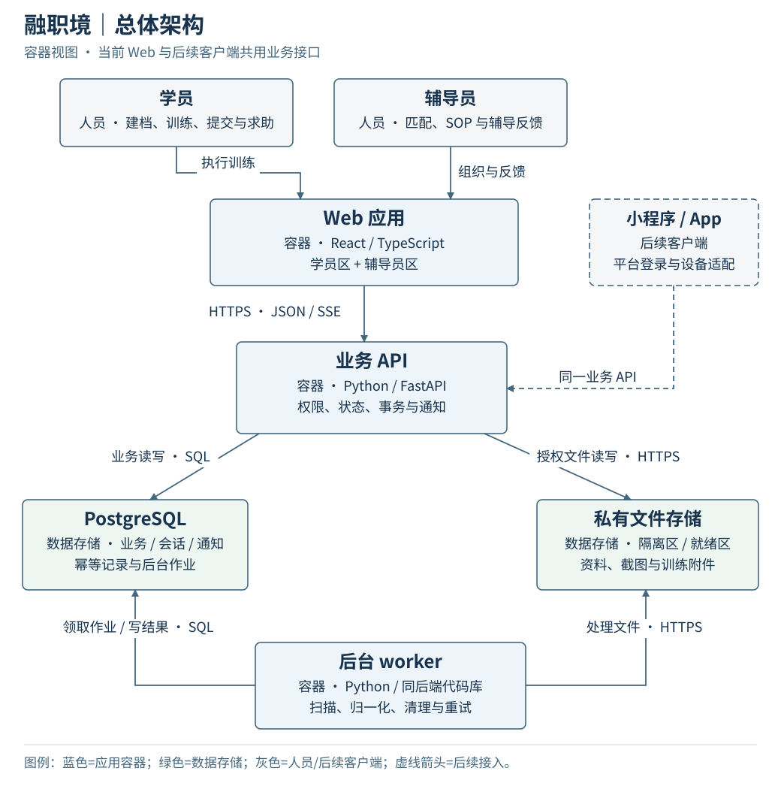
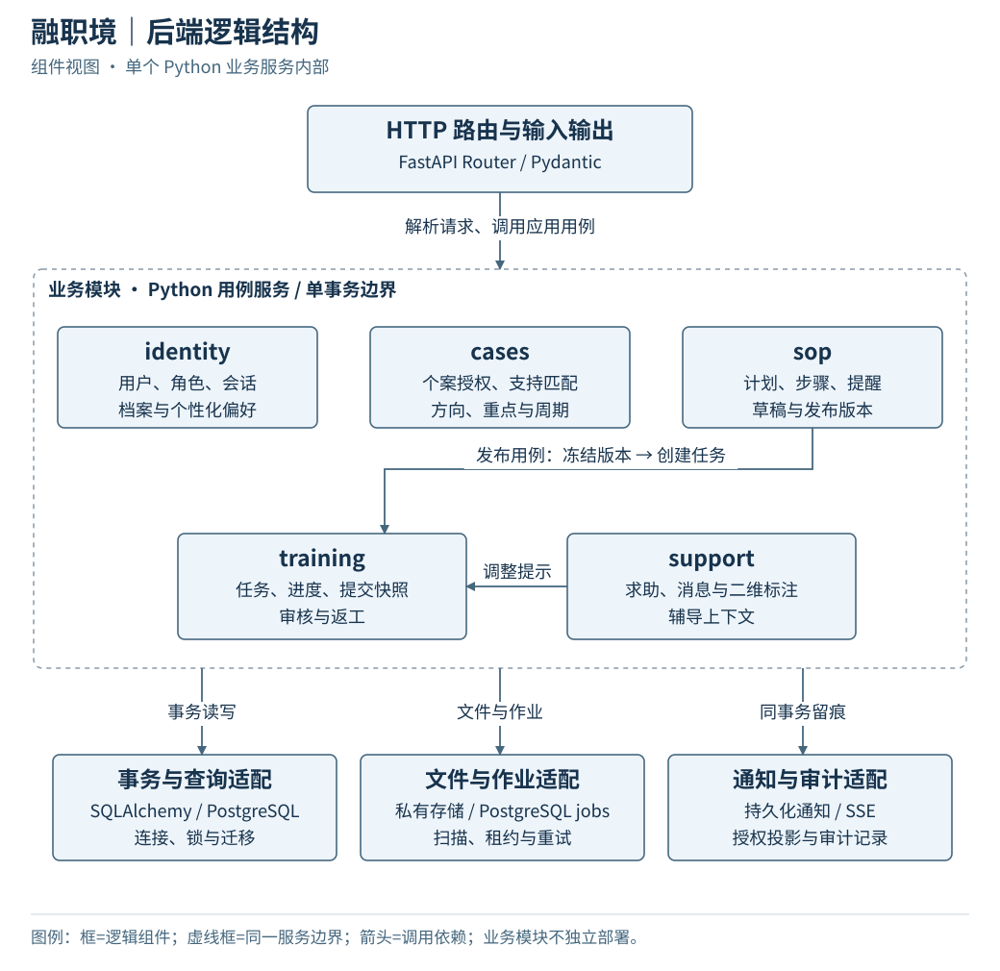
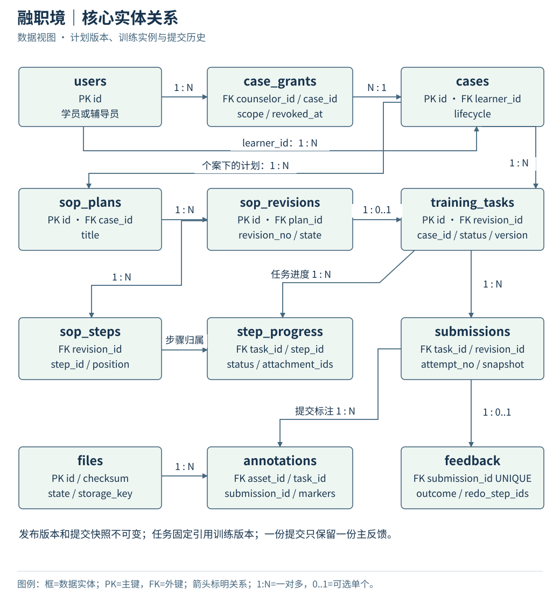
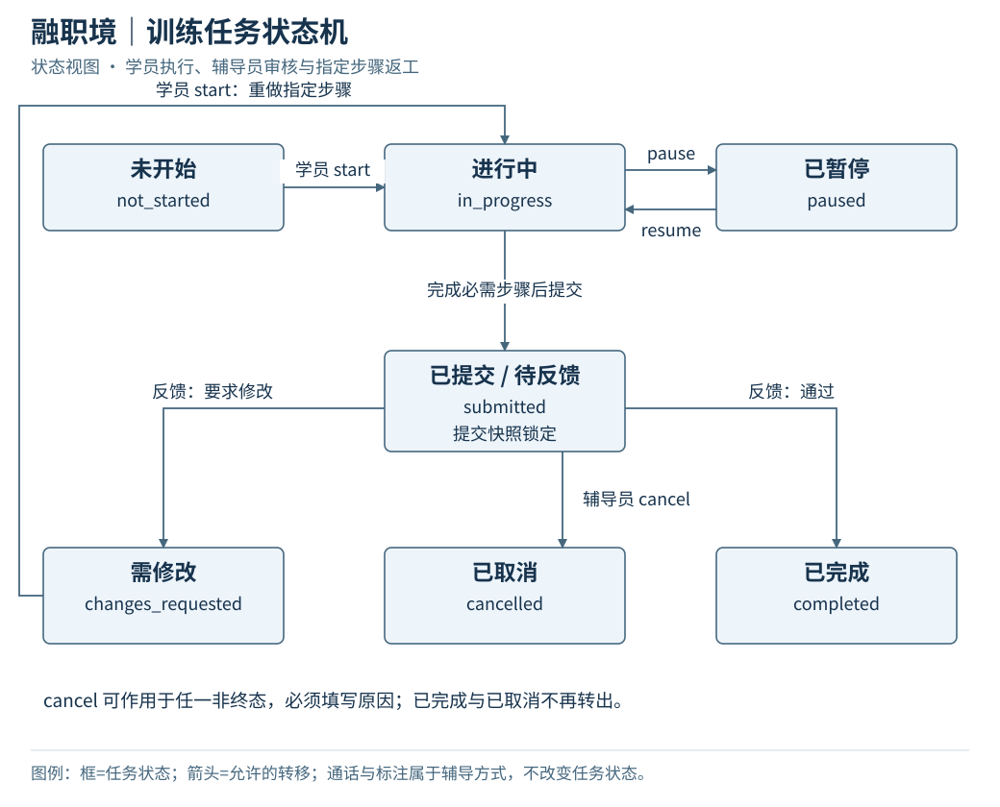
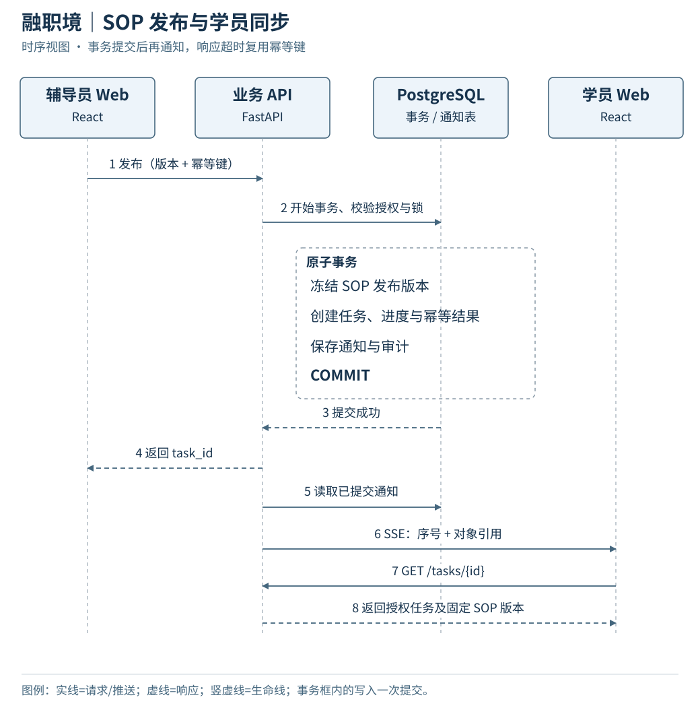
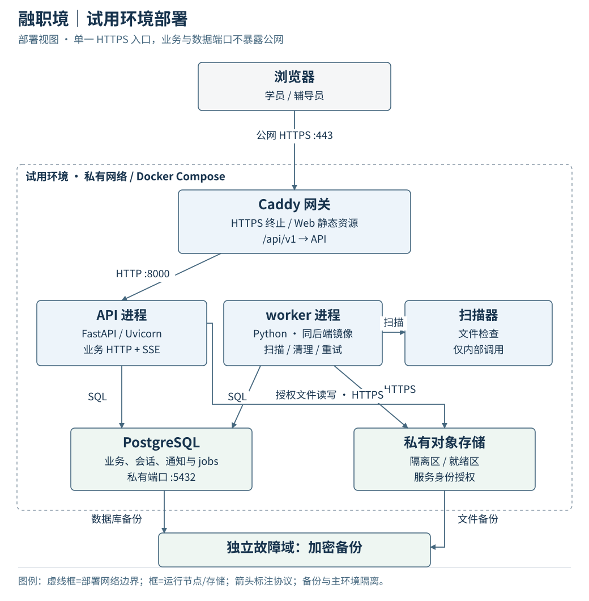

# 融职境系统架构设计文档

## 一、总体架构

融职境采用 **React Web + Python 模块化单体 + PostgreSQL + 私有文件存储**。学员端与辅导员端共用一个 Web 工程；身份、支持关系、SOP、训练与反馈由同一后端管理。后续小程序和 App 接入相同业务 API，设备能力在客户端适配。

### 1.1 业务范围

主流程：**学员建档 → 支持匹配 → SOP 发布 → 分步训练 → 提交 → 辅导反馈 → 修改或完成**。首个贯通案例为“文档质检助理”。[P1][P2]

| 交付阶段 | 功能范围 | 完成条件 |
| --- | --- | --- |
| 最小业务闭环 | 登录、资料与偏好、私有上传、人工确认匹配、结构化 SOP、训练、提交与反馈 | 同一学员完成发布、执行、返工、再次提交和通过；两端数据一致，历史可追溯 |
| 辅导支持 | 截图标注、上下文求助与留言、实时通知、训练记录、提示等级调整 | 断线后能恢复；求助有明确响应状态；跨设备标注位置一致 |
| 扩展能力 | 实时通话、自动 SOP 转换、AR/3D、企业报告、小程序与 App | 分别确定输入输出、平台和验收用例后排期 |

### 1.2 总体架构图



Web 通过同源 HTTPS 访问 `/api/v1`。API 处理业务请求与通知订阅；worker 处理文件扫描和清理，二者共享代码与数据库。文件只经授权接口读取。通知使用 SSE，断线通过通知列表补拉。

### 1.3 技术栈

| 层次 | 选型 | 职责 |
| --- | --- | --- |
| 前端语言与构建 | TypeScript、React、Vite、pnpm | 单页应用、类型检查、构建与依赖管理 |
| 路由与服务端状态 | React Router、TanStack Query、类型化 fetch | 角色路由、查询缓存、请求取消与刷新 |
| 表单与样式 | React Hook Form、CSS Modules、CSS 变量 | 表单校验、局部样式、字号与低刺激主题 |
| 后端 | Python、FastAPI、Pydantic、Uvicorn | HTTP 接口、输入输出校验、业务用例 |
| 数据访问 | PostgreSQL、SQLAlchemy、psycopg、Alembic | 关系数据、事务、查询与版本化迁移 |
| 契约 | OpenAPI 3.1.1、openapi-typescript | 请求响应定义、前端类型生成、契约比对 |
| 文件与作业 | 私有对象存储、PostgreSQL jobs、同代码库 worker | 文件隔离、扫描、重试与清理 |
| 测试 | pytest、HTTPX、Vitest、Testing Library、MSW、Playwright | 单元、接口、组件、模拟与双端端到端测试 |
| 工程与部署 | Ruff、mypy、ESLint、Docker Compose、Caddy、GitHub Actions | 静态检查、容器部署、HTTPS 入口与持续集成 |

空骨架提交运行时版本、`pnpm-lock.yaml`、`uv.lock` 和镜像摘要；生产环境禁止浮动 `latest`。C++ 不进入首版业务服务。

### 1.4 关键取舍

| 决策 | 采用方案 | 取舍 |
| --- | --- | --- |
| 单体或微服务 | 按业务分模块的单体 | 发布、提交与反馈可在一个事务内完成；模块隔离依赖公开接口和依赖检查 |
| SPA 或全栈框架 | React SPA + Python API | 登录后工作台不依赖服务端渲染；路由、缓存和错误处理由前端统一建设 |
| 立即跨端或 Web 优先 | Web 优先、共用业务契约 | 先完成业务闭环；后续按目标平台适配界面和设备能力 |
| 认证方式 | 服务端会话 + HttpOnly Cookie | 支持集中撤销；需要 CSRF 校验与会话存储 |
| 内容与历史 | 不可变 SOP 发布版、提交快照与主反馈 | 增加历史数据量，避免方案变更改写训练依据 |
| 通知与作业 | 数据库持久化 + SSE + worker | 减少独立基础设施；扩容前检查数据库负载与长连接容量 |

## 二、模块与工程结构

### 2.1 后端组件



| 模块 | 数据归属与职责 | 对外协作 |
| --- | --- | --- |
| `identity` | 用户、角色、会话、档案、偏好、外部身份映射 | 提供当前主体、档案与偏好查询 |
| `cases` | 个案、分配授权、支持方向、重点、周期与匹配 | 提供个案访问校验、匹配确认及工作台查询 |
| `sop` | 计划、草稿、发布版本、步骤与提醒设置 | 提供版本读写、发布校验与冻结 |
| `training` | 任务、步骤进度、观测事件、提交与反馈 | 提供执行、提交、审核、返工和训练记录 |
| `support` | 求助、消息、二维标注及辅导记录 | 提供上下文交流、标注发布与提示调整入口 |
| `infrastructure` | 数据库、文件、作业、通知、审计适配 | 提供存储与外部能力，不承载业务判断 |

路由负责协议转换，用例服务负责事务与业务规则。跨模块写入调用公开服务，不直接修改其他模块的表。发布用例协调 `sop` 与 `training`，共享一个事务；内部函数不得自行 `commit`。工作台聚合通过查询服务读取，并在查询前限制授权个案。

### 2.2 仓库结构

```text
job-lens/
├── apps/
│   ├── web/src/
│   │   ├── app/                 # 路由、Provider、应用壳
│   │   ├── features/            # profile、learner、counselor、sop、training、support
│   │   ├── shared/
│   │   │   ├── ui/              # 基础交互组件
│   │   │   ├── api/             # 类型、请求与查询键
│   │   │   └── platform/        # 相机、语音、震动、文件
│   │   ├── index.css            # reset、基础排版、可访问性
│   │   └── theme.css            # 色彩、字号、间距与主题变量
│   └── api/
│       ├── app/modules/         # identity、cases、sop、training、support
│       ├── app/core/            # 配置、错误、认证授权入口
│       ├── app/infrastructure/  # db、storage、jobs、notifications
│       ├── migrations/
│       └── tests/
├── contracts/                  # 经确认的 OpenAPI 与示例
├── tests/e2e/                  # 双端贯通测试
├── infra/                      # 容器、网关、部署配置
└── docs/
```

后端模块先采用 `router.py / schemas.py / service.py / models.py`，复杂后再拆查询与仓储。前端页面样式就近维护；`shared` 只收纳双端复用能力。新增第二个客户端时，再提取已验证的纯逻辑包。

### 2.3 前端边界

| 区域 | 路由 | 主要接口 |
| --- | --- | --- |
| 公共 | `/login`、`/profile`、`/preferences` | `/auth/*`、`/me/*` |
| 学员 | `/learner`、`/learner/tasks/:id`、`/learner/records` | `/dashboard`、`/tasks/*`、`/cases/{id}/records` |
| 辅导员 | `/counselor`、`/counselor/cases/:id`、`/counselor/sop/:id`、`/counselor/submissions/:id` | `/cases/*`、`/sop-*`、`/submissions/*` |
| 辅导支持 | 具体任务、提交或求助下的标注与消息页面 | `/annotations/*`、`/assistance-requests/*` |

服务端数据进入 TanStack Query；表单草稿留在表单状态，设备状态留在组件或平台适配层。退出或权限撤销时清除相关缓存。每页覆盖加载、空数据、失败、无权限和版本冲突；保存失败保留输入，`412` 后展示差异并重新确认，不自动覆盖。

## 三、数据模型

### 3.1 实体关系



资源 ID 使用 UUID；业务编号独立。时间存储为 UTC，接口输出 RFC 3339；业务日期使用 `YYYY-MM-DD`。可变聚合维护 `version`，不可变快照维护 `schema_version`。

### 3.2 数据与约束

| 数据表 | 核心字段 | 约束 |
| --- | --- | --- |
| `users / sessions` | login_name、password_hash、token_hash、expires_at、revoked_at | 登录名唯一；会话只存令牌摘要；角色由服务端授予 |
| `profiles / preferences` | user_id、感官与沟通偏好、work_notes、字号、音量、安静模式 | 一用户一份；资料与界面偏好独立版本 |
| `cases / case_grants` | learner_id、counselor_id、scope、revoked_at | 匹配前先分配访问权；撤销后停止访问 |
| `support_matches` | case_id、direction、focus、cycle_weeks、basis、state | 每个个案一份当前匹配；草稿确认后锁定 |
| `sop_plans / sop_revisions` | case_id、plan_id、revision_no、goal、published_at | 计划内版本号唯一；至多一份当前草稿；发布内容不可变 |
| `sop_steps` | revision_id、step_id、position、instruction、media_ids、evidence_required | 同版本内步骤标识与顺序唯一；媒体必须就绪 |
| `training_tasks / step_progress` | case_id、revision_id、status、current_step_id、version；step_id、attachment_ids | 固定引用发布版；进度步骤必须属于该版本 |
| `submissions / feedback` | task_id、attempt_no、snapshot；submission_id、outcome、redo_step_ids | 提交序号唯一；每次提交一份主反馈；历史不可覆盖 |
| `annotations` | task_id、submission_id、asset_id、markers、state | 原图和提交同上下文；发布后不可变 |
| `assistance / messages` | case_id、task_id、step_id、state；request_id、author_id、body | 参与者来自支持关系；消息追加写；关闭后不追加 |
| `files / file_links` | purpose、storage_key、checksum、mime、size、state；resource_ref | 文件私有；关联时验证上下文；引用中不可直接删除 |
| `notifications / counters` | recipient_id、seq、resource_ref、read_at | 接收者与序号联合唯一；按接收者保证提交顺序 |
| `idempotency / jobs / audit` | request_hash、response_ref；lease、attempts；actor、action、result | 幂等键作用域唯一；作业可恢复；审计追加写 |

数据库约束至少包含：`UNIQUE(plan_id, revision_no)`、草稿的部分唯一索引、`UNIQUE(task_id, attempt_no)`、`UNIQUE(submission_id)`、`UNIQUE(recipient_id, seq)`。步骤进度以 `(revision_id, step_id)` 复合外键校验版本归属。文件关联与删除共用文件行锁，防止“关联成功但对象已删除”的竞态。

查询索引覆盖 `case_grants(counselor_id, revoked_at)`、`training_tasks(case_id, status)`、`submissions(task_id, attempt_no)`、`notifications(recipient_id, seq)` 和 `jobs(state, next_run_at)`。索引随实际查询计划调整。

### 3.3 状态模型



| 对象 | 持久化状态 | 展示规则 |
| --- | --- | --- |
| 个案 | pending_match、active、closed | SOP 待制定、训练中、待反馈从关联对象派生 |
| SOP 版本 | draft、published、archived | “已调整”生成新版本；“进行中”取任务状态 |
| 任务 | not_started、in_progress、paused、submitted、changes_requested、completed、cancelled | submitted 在辅导员端显示“待反馈”；通话与标注为辅导方式 |
| 求助 | queued、accepted、resolved、cancelled | 已发送、已接单、已解决分别显示 |
| 文件 | quarantined、scanning、ready、rejected、deleted | 仅 ready 可下载和绑定业务对象 |

任务执行规则：学员从 `not_started` 或 `changes_requested` 开始；`in_progress` 可暂停，暂停后恢复。提交要求全部必需步骤完成并锁定快照。返工只重置指定步骤，旧提交继续保留。`completed`、`cancelled` 为终态；取消由辅导员执行并记录原因。

PRD 的状态展示映射到上述存储模型，保留“待匹配、SOP 待制定、待反馈”等界面术语。[P2，15 节]

### 3.4 三个事务

| 用例 | 校验 | 原子写入 |
| --- | --- | --- |
| 发布 SOP | 个案授权、匹配已确认、草稿版本正确、目标与步骤完整、素材就绪 | 冻结版本、创建唯一任务、初始化进度、通知与审计 |
| 提交训练 | 任务归属、可提交状态、任务版本、必需步骤和附件 | 读取服务端进度生成快照、分配 attempt_no、任务转 submitted、通知 |
| 审核反馈 | 辅导员授权、最新未审提交、任务版本、返工步骤有效 | 写主反馈；完成任务或重置返工步骤；通知与审计 |

发布和提交使用业务唯一约束与幂等记录双重去重。用例按固定顺序获取授权、聚合与通知计数行锁；并发编辑返回 `412`，业务状态冲突返回 `409`。

## 四、接口与运行流程

### 4.1 通用协议

| 项目 | 契约 |
| --- | --- |
| 基础路径与格式 | `/api/v1`；JSON 字段 `snake_case`；上传使用 multipart，通知使用 `text/event-stream` |
| 认证 | Web 使用服务端 Cookie 会话；写请求校验 Origin 与 `X-CSRF-Token` |
| 幂等 | 业务 POST 携带 `Idempotency-Key`，登录、退出除外；16–128 个可打印非空 ASCII 字符 |
| 并发 | 修改可变聚合与状态命令携带 `If-Match`；GET 返回 `ETag`；缺失返回 428，过期返回 412 |
| 分页 | limit 默认 20、最大 100；不透明 cursor；返回 items、next_cursor、has_more |
| 错误 | `application/problem+json`，包含 type、title、status、code、trace_id；字段错误进入 errors |
| 写入边界 | 请求拒绝未声明字段；作者、角色和资源归属由服务端确定 |
| 列表授权 | 先过滤资源权限，再分页与统计 |

错误模型采用 RFC 9457；条件请求使用 HTTP 的 ETag/If-Match 机制。[R2][R3] 具体操作、字段与示例见附录及 [API 契约](api-contract.md)，机器定义见 [openapi.yaml](openapi.yaml)。

幂等作用域为“主体 + 方法 + 规范路径 + key”，指纹包含请求内容与版本条件。同键同请求返回原结果，不同请求返回 `409`。重放前重新授权；成功重放优先于原版本过期判断。幂等记录保留 24 小时，过期后仍由业务唯一约束约束重复创建。

任务子资源修改使用任务版本。`Submission` 同时返回不可变快照与当前 `task_version/task_status`，审核使用该任务版本。资料与界面偏好独立写入；辅导员画像将两者以只读投影返回。

### 4.2 发布与通知时序



通知只携带类型、对象引用与序号。客户端收到通知后重新读取业务对象；响应超时用原幂等键重试，不创建新的发布操作。

### 4.3 错误处理

```json
{
  "type": "urn:job-lens:problem:version-conflict",
  "title": "资源已更新",
  "status": 412,
  "code": "VERSION_CONFLICT",
  "detail": "请刷新任务后重新确认。",
  "trace_id": "req_example_001"
}
```

| 状态 | 含义 | 客户端行为 |
| --- | --- | --- |
| 401 | 会话失效 | 清理私有缓存并重新登录 |
| 403 / 404 | 无操作权限 / 不存在或无读取权限 | 停止当前操作，返回可访问页面 |
| 409 | 状态、幂等或唯一约束冲突 | 展示业务原因，读取相关对象 |
| 410 | 通知游标过期 | 从保留窗口同步，刷新任务与求助 |
| 412 / 428 | 版本过期 / 缺少版本 | 重新读取资源，保留本地输入并确认变更 |
| 413 / 415 / 422 | 文件过大 / 类型不支持 / 字段校验失败 | 定位文件或字段，允许修改重试 |
| 429 / 503 | 限流 / 暂时不可用 | 按 Retry-After 有限退避 |

## 五、文件、标注与实时支持

### 5.1 文件处理

上传路径：**授权 → 体积与类型检查 → 私有隔离 → 持久化扫描任务 → 扫描与图片归一化 → ready/rejected**。

图片限 10 MiB，PDF/DOCX 限 20 MiB，业务单次最多关联 5 个附件。校验真实 MIME、文件签名、像素量、解压尺寸和处理超时；拒绝 HTML、SVG、可执行文件与宏文档。扫描失败保持隔离。[R4]

API 以授权流返回文件内容，设置安全 Content-Disposition 和 `nosniff`。PDF/DOCX 下载后阅读，标注使用单独上传的截图。存储键不进入业务响应。未关联文件 24 小时后清理；已引用文件返回 `FILE_IN_USE`。

### 5.2 二维标注

图片应用 EXIF 方向后生成固定展示图，记录尺寸与校验和。点标注保存 `x/y`，框标注保存 `x/y/width/height`，值为原图归一化坐标。服务端校验 `x + width ≤ 1`、`y + height ≤ 1`；前端换算扣除 `object-fit` 留白。

学员创建问题标注 `question`，辅导员创建指引 `guidance`。草稿仅作者可见，发布后参与者可见。更换原图必须新建文件与标注；主反馈只能引用同一提交的已发布标注。

### 5.3 求助与消息

求助绑定 `case_id`，可附带 `task_id/step_id`；嵌套标识必须逐级归属一致。接收者由支持关系确定。相同上下文已有未结束求助时返回现有线程；无照片仍可发送文字。

界面区分发送中、已发送待响应、已接单、已解决和失败。辅导员接单后进入 `accepted`，处理完转 `resolved`；学员可取消未结束请求。消息追加写，关闭后不可继续发送。

### 5.4 通知恢复

业务、通知和审计同事务提交。通知序号按接收者分配，计数行锁持有至提交；多接收者按 user_id 排序获取锁，防止较大序号先提交造成漏读。

SSE 每 15 秒心跳，网关关闭缓冲；断线指数退避。客户端用 `Last-Event-ID` 或 `after_seq` 补拉，前者优先；SSE 不可用时每 5 秒轮询。页面回到前台重新读取业务状态。

序号以十进制字符串传输。`next_seq` 等于最后返回条目的序号；无新增时保持请求值。`after_seq=0` 从最早保留记录读取，非零且过期返回 `410`。通知保留 30 天，按 ID 去重。会话失效或资源授权撤销后停止推送；通知已读不改变任务完成状态。

## 六、身份、权限与跨端

### 6.1 会话与授权

首轮账号通过受控初始化命令发放，并创建学员个案、空匹配草稿及辅导员 `case_grant`。命令调用业务服务并留审计。公开注册与辅导员资格审核另列开发任务。

会话令牌使用 256 位随机值，数据库仅存摘要。Cookie 为 `__Host-jl_session`，配置 `Secure / HttpOnly / Path=/ / SameSite=Lax`，不设置 Domain。登录前获取 CSRF，登录成功轮换会话；会话绝对有效期 12 小时、闲置期 2 小时。退出、禁用和凭据变更撤销会话。[R5]

| 资源 | 学员 | 已授权辅导员 |
| --- | --- | --- |
| 档案与偏好 | 读写本人 | 只读支持所需字段 |
| 个案与匹配 | 读取本人进度 | 读取已分配个案、编辑并确认匹配 |
| SOP | 读取本人发布版与历史引用版 | 编辑草稿、发布、创建修订 |
| 任务与提交 | 执行、暂停、提交本人任务 | 查看、审核、按原因取消 |
| 标注、求助、消息 | 参与本人上下文 | 接单、回复、发布指引与解决求助 |
| 文件 | 读取有权限且就绪的对象 | 同左；草稿素材按作者限制 |

无关辅导员一律无权访问。每次请求检查会话、动作权限、资源关系、业务状态和字段白名单；文件、列表、统计和通知执行相同边界。[R6]

### 6.2 数据处理

日志不记录密码、令牌、档案正文、文件内容和完整企业材料；记录 trace_id、对象 ID、动作、结果与耗时。角色授予、个案分配与撤销、发布、反馈和文件访问进入追加式审计。

首版仅收集支持资料和训练数据，不默认收集诊断证明、身份证、GPS，也不录制通话。训练报告给出统计窗口、计算口径和缺失值；客户端上报事件不直接作为能力评分。业务资料、审计及备份的保留和删除周期在试用前确定。

### 6.3 设备适配与多端接入

| 能力 | Web 实现 | 降级路径 |
| --- | --- | --- |
| 相机与文件 | `captureImage / pickFile`；HTTPS、用户动作触发 | 权限拒绝或设备占用时选已有图片或发文字 |
| 语音 | `speak`；用户主动开启，始终保留文字 | 播报失败不阻断步骤 |
| 震动 | `vibrate`；检测设备支持 | 视觉提示替代 |
| 标注 | 共用几何数据，Web 实现编辑与呈现 | 可阅读文字列表 |
| 通话 | `CallAdapter` 对接选定 SDK | 拒绝授权、断线时回到求助线程 |

设备调用返回 `success / unsupported / permission_denied / cancelled / failed`，避免把用户取消与系统故障混为一类。浏览器相机要求安全上下文与授权；震动按能力检测使用。[R7][R8]

字号、音量与提示方式从本人偏好加载；安静模式优先于任务提醒。界面支持键盘、焦点可见、200% 缩放和非颜色提示，按 WCAG 2.2 AA 对应条目验收。[R9]

小程序和 App 复用用户、个案、SOP、任务与提交接口；外部身份映射到内部 user_id。客户端分别实现登录凭据传输与设备适配，不把 Web Cookie 写进 URL。采用 Web 容器时重点验证登录、相机、文件与后台恢复；采用原生页面时复用数据契约与纯逻辑，替换 React DOM 组件。

## 七、部署与运行保障

### 7.1 部署拓扑



开发、测试、试用环境隔离数据库、文件空间、密钥和账号。公网仅开放 Caddy 的 HTTPS 入口；API、PostgreSQL、worker 和扫描器位于私有网络。API 与 worker 使用同一后端镜像的不同启动命令。

普通 SQLAlchemy 调用在同步请求线程执行；异步 SSE 使用异步数据库会话，避免阻塞事件循环。worker 通过租约和 `FOR UPDATE SKIP LOCKED` 领取任务；超时可重新领取，处理结果按作业 ID 去重。数据库连接池、请求并发与 worker 并发分别设上限。

### 7.2 发布与恢复

CI 执行格式、静态类型、单元、契约和双端 E2E 检查。OpenAPI 生成前端类型；后端运行时契约与基线做规范化比对，禁止直接覆盖运行时 Schema 以绕过检查。

迁移作为独立发布步骤运行，采用“扩展字段 → 迁移数据 → 切换代码 → 收缩旧结构”。应用回滚保持兼容的数据库结构；破坏性迁移前备份并验证恢复。

监控 API 错误率与 p95 延迟、数据库连接、通知延迟、扫描积压、worker 心跳及存储容量。`/health/live` 检查进程，`/health/ready` 检查关键依赖。每日加密备份放在独立故障域，恢复同时核对数据库记录与文件对象。

### 7.3 验收指标

| 项目 | 测试条件与门槛 |
| --- | --- |
| 业务贯通 | 发布、执行、提交、返工、再提交、通过全部通过；非法状态转移有负例 |
| 权限隔离 | 两学员、两辅导员交叉访问列表、详情、文件、消息、统计与通知均不能越权 |
| 并发与幂等 | 同键发布只一任务、同键提交只一快照；同版本并发编辑最多一个成功 |
| JSON API | 100 活跃会话、10 req/s、10 万合成事件；p95 ≤ 800 ms、错误率 < 1%，排除文件与通话 |
| 在线通知 | 健康网络下从事务提交到活跃 Web 展示 p95 ≤ 3 秒；断线补拉不漏待处理事项 |
| 设备与交互 | 固定版本的桌面浏览器、Android Chrome、iOS Safari；相机失败、弱网、键盘与缩放测试通过 |
| 恢复 | 重启后任务、求助与作业可恢复；备份恢复目标 RPO ≤ 24 小时、RTO ≤ 4 小时 |

## 八、分工与开发路径

### 8.1 四人分工

| 成员 | 主责 | 交付 |
| --- | --- | --- |
| 刘峥岩 | 总体架构、范围与技术决策、统筹、评审 | 架构边界、阶段计划、关键决策与阶段验收 |
| 贺凡恩 | 后端、数据库、权限、接口、作业与部署 | 数据模型、API、迁移、测试及运行环境 |
| 前端 A | 公共前端、学员端、设备适配 | 工程基础、登录偏好、训练执行、上传、记录与求助 |
| 前端 B | 辅导员端、SOP、反馈与标注 | 工作台、个案匹配、SOP 编辑发布、审核、标注及联调 |

A 牵头公共组件与接口层，B 共建；各成员负责模块自测，双端业务共同联调。

### 8.2 阶段交付

| 阶段 | 工作内容 | 依赖 | 验收 |
| --- | --- | --- | --- |
| M0 架构设计 | 总体图、模块、数据、状态、接口、分工与范围确认 | 产品流程 | 关键对象、接口和模块责任无冲突 |
| M1 空骨架 | 前后端工程、迁移环境、健康检查、契约生成、CI 与部署 | M0 | 三名开发者按同一说明启动；空骨架经 PR 合并 |
| M2 业务闭环 | 账号资料 → 匹配 → SOP → 任务 → 提交反馈 | M1 | 一名学员和辅导员以真实接口完成返工闭环 |
| M3 辅导与试用 | 标注、求助消息、通知恢复、记录、真机、安全与恢复测试 | M2 | 图文辅导闭环、权限与文件安全、恢复验收通过 |
| M4 多端与扩展 | 按实际需要接通话、转换、AR、报告或新客户端 | 对应扩展规格 | 目标平台及扩展用例独立验收 |

### 8.3 开发任务依赖

| 任务 | 主责 | 前置 | 完成标准 |
| --- | --- | --- | --- |
| T01 工程、CI、契约生成 | 贺凡恩、A | 架构确认 | 前后端可启动，类型生成和检查可重复 |
| T02 账号、档案、偏好与个案授权 | 贺凡恩、A | T01 | 双角色登录；本人资料写入；跨个案访问拒绝 |
| T03 文件存储、隔离扫描与上传组件 | 贺凡恩、A | T02 | 上传状态、拒绝原因、授权下载与删除冲突可测 |
| T04 个案列表、画像与支持匹配 | 贺凡恩、B | T02 | 辅导员只看分配个案；匹配后学员可见关系 |
| T05 SOP 编辑、版本与发布 | 贺凡恩、B | T03、T04 | 草稿保存、版本冻结、重复发布不重复建任务 |
| T06 学员分步训练与提交 | 贺凡恩、A | T05；UI 可按契约并行 | 暂停恢复、附件绑定、服务端提交快照 |
| T07 审核、返工与历史 | 贺凡恩、B；A 联调 | T06 | 只审核最新提交，返工不覆盖旧记录 |
| T08 标注、求助与消息 | 贺凡恩、B；A 接入 | T03、T07 | 点位一致、线程持久化、状态与权限正确 |
| T09 SSE、事件统计与提示覆盖 | 贺凡恩、A、B | T07、T08 | 重连恢复、去重统计、安静模式优先 |
| T10 双端 E2E、真机与发布演练 | 贺凡恩、A、B | T07–T09 | 第七章验收通过，阻断问题清零 |

后端先实现 T02–T07 的关键链；A、B 根据契约与 MSW 并行开发界面。每完成一个业务环节立即接真实 API，不等所有页面完成后集中联调。刘峥岩审核范围与关键变更，不承担固定页面或接口实现。

## 九、扩展与未决项

### 9.1 扩展接口边界

| 能力 | 接口边界 | 必须补齐的设计 |
| --- | --- | --- |
| 平台登录 | `POST /auth/exchanges/{provider}` | 平台 code 防重放、内部账号绑定、凭据存储与解绑 |
| 实时通话 | `POST /assistance-requests/{id}/calls`；`GET /calls/{id}`；`POST /calls/{id}/actions` | 邀请、接听、拒接、超时、断线、媒体授权和费用 |
| 通话凭据与回调 | `/calls/{id}/join-token`；`/integrations/rtc/events` | 单房间短时凭据；回调验签、去重与乱序处理 |
| 通话纪要 | `/calls/{id}/notes` | 作者、修订记录与保存范围 |
| SOP 转换 | `/sop-plans/{id}/conversion-jobs`；`/conversion-jobs/{id}` | 输入授权、输出 Schema、超时重试；转换结果进入草稿 |
| 企业报告 | `/cases/{id}/report-exports`；`/report-exports/{id}` | 字段白名单、接收者授权、有效期、撤回与访问审计 |
| 重复训练与并行 | `/tasks/{id}/repetitions` 或独立任务创建接口 | 实例身份、排期、并发限制与统计口径 |

### 9.2 需确认的业务规则

| 决策项 | 当前设计 | 确认责任与时间 |
| --- | --- | --- |
| 同一学员任务并行与重训 | 同个案最多一项非终态任务；重复发布返回原任务 | 刘峥岩与产品方，T05 前 |
| 通话是否进入首轮试用 | 图文闭环先行；通话按独立能力接入 | 刘峥岩与产品方，M0 |
| 自动转换、AR/3D 的首版深度 | 手工结构化 SOP、截图二维标注 | 刘峥岩与产品方，M0 |
| 账号资格、历史授权及数据留存 | 受控发放账号；到期撤销访问；企业导出关闭 | 产品方，贺凡恩落实，M3 前 |
| 报告指标与企业共享范围 | 展示训练事实、返工和提示依赖；无自动匹配分数 | 产品方，M3 前 |

## 参考

[P1]《项目简介》，两端、资料卡、支持关系与辅导记录。

[P2]《融职境-辅导员端页面 PRD》，8–15 节：画像、匹配、SOP、反馈、通话、标注与状态。

[P3]《学员端页面 PRD》，个性化、分步训练、求助、资料、转换与 AR。

[R1] [C4：图示符号与检查清单](https://c4model.com/diagrams/notation)。

[R2] [RFC 9457：HTTP API 错误模型](https://www.rfc-editor.org/rfc/rfc9457.html)。

[R3] [RFC 9110：HTTP 条件请求](https://www.rfc-editor.org/rfc/rfc9110.html)。

[R4] [OWASP：文件上传安全](https://cheatsheetseries.owasp.org/cheatsheets/File_Upload_Cheat_Sheet.html)。

[R5] [OWASP：会话管理](https://cheatsheetseries.owasp.org/cheatsheets/Session_Management_Cheat_Sheet.html)。

[R6] [OWASP：授权](https://cheatsheetseries.owasp.org/cheatsheets/Authorization_Cheat_Sheet.html)。

[R7] [MDN：getUserMedia](https://developer.mozilla.org/en-US/docs/Web/API/MediaDevices/getUserMedia)。

[R8] [MDN：Vibration API](https://developer.mozilla.org/en-US/docs/Web/API/Vibration_API)。

[R9] [W3C：WCAG 2.2](https://www.w3.org/TR/WCAG22/)。

[R10] [OpenAPI 3.1.1](https://spec.openapis.org/oas/v3.1.1.html)。
